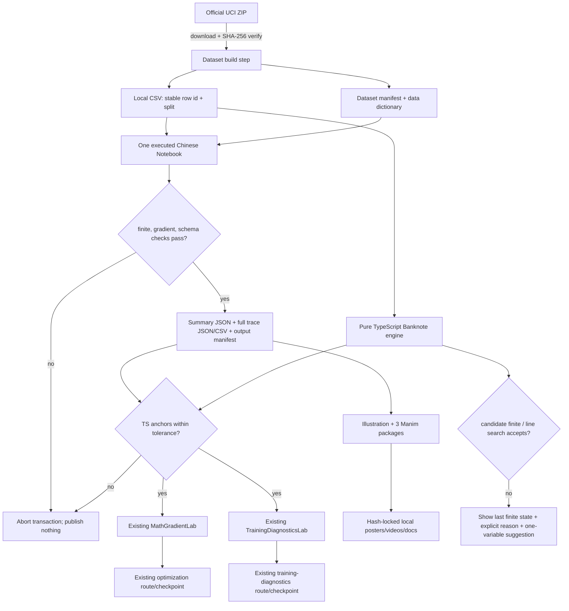

# Phase 25: Numerical Methods Batch 4 — Logistic Regression Optimization and Training Diagnostics - Research

**Researched:** 2026-07-21
**Domain:** Deterministic binary logistic-regression optimization, training diagnostics, Notebook/browser parity, and auditable local media
**Confidence:** HIGH — phase boundaries and architecture are locked in context and code; numerical constants were reproduced in a clean kernel using the proposed pins; external API details are cited from current official sources. [VERIFIED: 25-CONTEXT.md + codebase inspection + clean-kernel execution]

<user_constraints>
## User Constraints (from CONTEXT.md)

### Locked Decisions

### Continuous Teaching Case
- **D-01:** Use a small logistic-regression model as the continuous case across both chapters.
- **D-02:** Use a verified local snapshot of UCI Banknote Authentication as the authoritative dataset. Preserve source, DOI, CC BY 4.0 attribution, file hash, schema, and data dictionary.
- **D-03:** Use a deterministic stratified `70% / 15% / 15%` train/validation/test split. Fit mean and scale on training data only, then reuse those values for validation and test data.
- **D-04:** The real Banknote runs cover feature-scale effects, slow convergence, stable convergence, oscillation/divergence, stable BCE, Armijo behavior, stopping, and safety exits. Existing deterministic synthetic diagnostic modes remain as explicitly labeled support examples for overfitting, vanishing gradients, and exploding gradients; they must not be presented as Banknote results.

### Reproducible Run Matrix and Stopping Semantics
- **D-05:** Produce five locked training runs: raw features with a fixed step, standardized features with a too-small step, standardized features with a stable fixed step, standardized features with a too-large step, and standardized features with Armijo backtracking.
- **D-06:** Add a separate extreme-logit check comparing a naive BCE calculation with a numerically stable BCE calculation. Do not invent a sixth training run merely to demonstrate overflow.
- **D-07:** Keep mathematical convergence, validation early stopping, and safety termination separate. Mathematical convergence uses gradient norm, or the conjunction of sufficiently small relative-loss change and parameter-step norm. Validation patience selects a model checkpoint; it does not prove convergence. `max-iterations`, `non-finite`, and `line-search-failed` are explicit safety exit reasons.
- **D-08:** Page summaries show the run start, first backtrack where applicable, best validation checkpoint, terminal checkpoint, final test report, and exact stop reason. Full per-step traces remain downloadable as local JSON/CSV beside the executed Notebook.
- **D-09:** Exact seed, fixed L2 strength, learning rates, tolerances, Armijo constants, validation patience, and rounded anchor values must be chosen by clean-kernel execution during research/planning and then locked in the contract and manifest. Do not choose values from visual preference alone.

### Chapter Boundary
- **D-10:** `optimization` focuses on stable BCE, the effect of feature scale, fixed-step gradient descent, Armijo backtracking, stopping criteria, and explicit failure exits. SGD/Momentum/RMSProp/Adam remain links to the existing optimizer-comparison lesson rather than repeated content. Newton/IRLS remains out of the primary route.
- **D-11:** `training-diagnostics` reads the same locked traces through a four-step teaching chain: what is visible, plausible cause, one variable to change, and what the next run should show. This is detailed instruction, not a scored diagnosis exercise.
- **D-12:** Use one shared, executed Chinese Notebook from data download and integrity checks through the five runs, final library baseline, and diagnostic report. Both pages reference chapter-specific cells and outputs from that one file.
- **D-13:** Upgrade the existing `MathGradientLab` and `TrainingDiagnosticsLab`; do not create parallel replacement labs. Each chapter keeps one primary lab, and prior synthetic modes remain available as comparison surfaces.

### Code Depth and Independent Checks
- **D-14:** The teaching authority is a manual NumPy implementation. Use Pandas for data loading and SciPy for stable mathematical-function comparisons.
- **D-15:** Build the manual path in layers: `stable_bce`, `loss_and_grad`, `armijo_step`, `should_stop`, then `train_logistic`. Page code blocks follow the same order and remain copyable.
- **D-16:** Add a pinned scikit-learn dependency and execute `LogisticRegression` only as a final engineering baseline. Compare final probabilities, test log loss, accuracy, coefficient direction, and prediction agreement. Do not claim per-iteration alignment between different solvers.
- **D-17:** Reuse the previous finite-difference chapter by running a visible gradient check against `loss_and_grad` before training. Repository tests also cover the gradient, Armijo acceptance, stopping state machine, finite-number boundaries, and Notebook/browser anchor agreement.

### Objective and Metric Boundary
- **D-18:** Use one fixed small L2 term in the manual and scikit-learn objectives, with the intercept excluded from regularization. Do not expand into L2 model selection. The exact strength is locked only after the Notebook demonstrates a finite, teachable optimum.
- **D-19:** Every run records train/validation BCE, gradient norm, parameter-step norm, accepted step size, backtrack count, validation checkpoint state, and terminal reason.
- **D-20:** Only the final selected model receives the compact test report: BCE, accuracy, ROC-AUC, and confusion matrix. The classification threshold is fixed at `0.5`; ROC-AUC uses probabilities. Do not add threshold tuning, PR-AUC, calibration analysis, or a complete model-evaluation course.
- **D-21:** `optimization` owns the five-run numerical comparison. `training-diagnostics` owns cross-run curve reading and the final test-report connection.

### Browser Labs and Failure Feedback
- **D-22:** Use preset-first controls that reproduce the five locked Notebook runs, plus bounded advanced controls. `MathGradientLab` may expose feature scale, fixed/Armijo method, learning rate, gradient tolerance, and maximum iterations. Keep L2, Armijo `c`, contraction `rho`, and validation patience fixed in the primary UI.
- **D-23:** `TrainingDiagnosticsLab` selects a primary run and a comparison run and may toggle curve visibility. It should not become a quiz or broad dashboard builder.
- **D-24:** On divergence or invalid arithmetic, stop at the last finite state and display one explicit reason such as `non-finite`, `line-search-failed`, or `max-iterations`, with one suggested single-variable change. Never silently replace the learner's parameters.
- **D-25:** Browser labs recompute the real local snapshot through deterministic TypeScript using the same formula and fixed constants as the Notebook. Do not use Pyodide or another browser Python runtime. Tests compare TypeScript anchors against the Notebook manifest.

### Illustration and Manim
- **D-26:** Create one shared three-panel illustration: raw versus standardized feature scale, fixed step versus Armijo backtracking, and train/validation loss plus gradient norm and terminal markers.
- **D-27:** Produce three short Manim packages rather than one or two longer packages: feature scaling and usable learning rate; fixed step versus Armijo; training traces, best validation point, terminal reason, and next single-variable experiment.
- **D-28:** All plotted values and labels in Manim must come from locked Notebook outputs. Media may simplify pacing and staging but may not introduce schematic replacement numbers.
- **D-29:** Use short Chinese labels inside the shared illustration and videos. Maintain one media set with bilingual page copy, Chinese transcripts, English summaries, label tables, local posters, reduced-motion fallback, metadata, and hashes.

### the agent's Discretion
- Select the exact compatible scikit-learn pin, fixed seed, L2 strength, learning rates, tolerances, Armijo constants, and patience only after reproducibility and teaching-shape checks.
- Choose exact section headings, chart colors, copy length, video timing, and milestone iteration rows within the locked teaching structure and existing design system.
- Choose whether full traces use one CSV per run or one normalized CSV plus JSON manifest, provided downloads are understandable and hash-auditable.

### Deferred Ideas (OUT OF SCOPE)
- Full SGD, Momentum, RMSProp, and Adam comparison remains in the existing optimizer-comparison course.
- Newton/IRLS and second-order logistic-regression optimization are deferred to an advanced numerical-optimization extension.
- L2 tuning, threshold selection, PR-AUC, calibration curves, full classification reporting, and experiment tracking are deferred to model-selection/evaluation work.
- Separate Chinese and English media renders are deferred; Phase 25 maintains one auditable media set.
- Browser Python/Pyodide, backend kernels, uploads, accounts, durable progress, Phase 24B Homepage Focus, and Phase 24C Spine progressive disclosure remain out of scope.
</user_constraints>

## Project Constraints (from AGENTS.md)

- Preserve typed Math Lab records and provide every new learner-facing string through `LocalizedCopy` with both `'zh-CN'` and `en`; each chapter must retain a complete question → concept → visual/lab → numeric/code connection → misconception/checkpoint → next-step loop. [VERIFIED: AGENTS.md]
- Keep variables, formulas, code, Notebook outputs, browser computation, media labels, and feedback consistent; quiz feedback must explain reasoning and point back to relevant content. [VERIFIED: AGENTS.md]
- Use `<script setup lang="ts">`; keep core math, parsing, scoring, and simulation logic outside large Vue components and cover it with Node tests. [VERIFIED: AGENTS.md]
- Upgrade the registered `MathGradientLab`, `TrainingDiagnosticsLab`, `MathLabNotebookCompanion`, and `ManimPlayer` patterns; keep page components focused on composition and all lab imports lazy. [VERIFIED: AGENTS.md + codebase inspection]
- Use D3 only for deterministic rendering after data derivation; provide labeled, keyboard-usable controls, reset behavior, bounded inputs, explicit current values, and mobile/static/text fallbacks. [VERIFIED: AGENTS.md]
- Generate Manim assets from `scripts/manim/`, synchronize metadata, and dispose of no new runtime animation resources because this phase uses pre-rendered video rather than Three.js. [VERIFIED: AGENTS.md + 25-CONTEXT.md]
- Serve every public asset from a leading-slash public path through `withPublicBase` or the adjacent existing helper; do not reference local absolute paths, temp outputs, or remote runtime images. [VERIFIED: AGENTS.md]
- Add no UI framework; place styles in the Math Lab module layer, preserve high contrast and formula readability, prevent mobile overflow, avoid color-only status, and keep key teaching information outside motion. [VERIFIED: AGENTS.md]
- Render Markdown/formulas only through `src/utils/markdownMath.ts` or its existing wrappers; never emit unsanitized raw HTML, scripts, inline event handlers, or uncontrolled iframes. [VERIFIED: AGENTS.md]
- Clamp and validate every learner-editable numeric input, reject `NaN`/`Infinity`, and return understandable failure feedback without silently changing parameters. [VERIFIED: AGENTS.md]
- Run focused tests for math/data/simulation changes, route/structure tests for page integration, sanitizer/public-base checks when those paths change, and `npm test`, `npm run build`, `npm run build:pages`, plus `npm run security:audit` at the phase gate. [VERIFIED: AGENTS.md]
- Preserve both old URLs, all three V1 progress stores, Progress V2, checkpoints, course inventory, and one-phase/one-PR migration boundaries; do not begin the paused Homepage/Spine work. [VERIFIED: AGENTS.md + .planning/config.json]
- Do not touch unrelated generated images or the user-owned untracked `docs/gpt_advice.md`; stage only Phase 25 files. [VERIFIED: AGENTS.md + git status]

## Summary

Implement Batch 4 as the next outer enhancer in the established Numerical Methods chain, not as a replacement course. A new pure TypeScript Banknote engine should own CSV parsing, train-only standardization, stable BCE, objective/gradient evaluation, Armijo, stopping, traces, and numeric guards. The existing two Vue labs should become thin consumers of that engine, while `aiBridgeMath.ts` continues to own the clearly labeled synthetic support scenarios. [VERIFIED: codebase inspection + 25-CONTEXT.md]

The exact recommended contract is now reproducible: two stratified scikit-learn splits with seeds `20260725` and `20260726`; 960/206/206 rows; population standard deviation (`ddof=0`); zero initialization; `lambda=1e-3`; fixed steps `4.0`, `0.02`, `4.0`, and `32.0`; Armijo initial step `32.0`, `c=1e-4`, `rho=0.5`; gradient tolerance `1e-5`; relative-objective tolerance `1e-10`; step tolerance `1e-7`; validation minimum improvement `1e-7`; patience `60`; and `maxIterations=500`. These values were executed from a clean temporary Jupyter kernel using the proposed pins and produced all five intended terminal shapes. [VERIFIED: clean-kernel execution]

The local snapshot should persist the generated split label beside each stable one-based row ID. Python owns split generation; both the Notebook and browser consume identical assignments, so TypeScript does not reimplement scikit-learn's RNG. Use one normalized CSV plus one JSON trace file for complete step data, with summary JSON and a hash manifest. [VERIFIED: clean-kernel execution + codebase inspection]

**Primary recommendation:** Build and lock the dataset/Notebook/trace contract first, then port the exact scalar formulas and state machine to TypeScript, then wire the two existing lessons and labs, and only then render the illustration and three Notebook-bound Manim packages. [VERIFIED: Batch 1–3 generator and media dependency pattern]

## Architectural Responsibility Map

| Capability | Primary Tier | Secondary Tier | Rationale |
|---|---|---|---|
| UCI acquisition, attribution, normalization, split assignment | Build tooling | Static storage | A generator verifies upstream bytes and publishes the local browser-readable snapshot; no runtime network is required. [VERIFIED: Batch 1–3 pattern + 25-CONTEXT.md] |
| Manual logistic training authority | Build tooling / Notebook | Browser client | NumPy produces the canonical traces; TypeScript independently recomputes them to tested tolerances. [VERIFIED: D-14 and D-25] |
| Dataset and trace distribution | CDN / Static | Browser client | GitHub Pages serves hash-locked CSV/JSON/Notebook/media through base-safe URLs. [VERIFIED: project architecture inspection] |
| Interactive preset execution | Browser / Client | — | Existing Vue labs load the local snapshot and invoke pure TypeScript; no backend or Pyodide exists in scope. [VERIFIED: D-22 through D-25] |
| Optimization teaching composition | Browser / Client | Static content | `optimization` owns the five-run numerical comparison and upgraded `MathGradientLab`. [VERIFIED: D-10, D-13, D-21] |
| Cross-run diagnostic composition | Browser / Client | Static content | `training-diagnostics` owns run comparison, four-step diagnosis, and the compact final report while retaining synthetic support examples. [VERIFIED: D-11, D-21, D-23] |
| Media rendering and integrity | Build tooling | CDN / Static | Manim and poster generation consume locked outputs, publish local files, and record hashes; runtime only plays or falls back. [VERIFIED: Batch 3 media code + D-27 through D-29] |
| Progress/checkpoints/routes | Browser / Client | Local storage | Existing IDs and storage paths remain untouched; only lesson content and lab internals deepen. [VERIFIED: route/progress code inspection + D-13] |

## Standard Stack

### Core

| Library | Version | Purpose | Why Standard |
|---|---:|---|---|
| Vue | existing `^3.5.30` | Existing labs and page composition | Already owns both registered lab surfaces and async page integration; no new UI framework is permitted. [VERIFIED: package.json + AGENTS.md] |
| TypeScript | existing `~5.9.3` | Typed run/config/trace/state contracts | The repository executes `.ts` tests directly with Node and uses typed Math Lab schemas. [VERIFIED: package.json + codebase inspection] |
| D3 | existing `^7.9.0` | SVG paths/scales for trace comparison | `TrainingDiagnosticsLab` already uses D3; numeric derivation remains in pure utilities. [VERIFIED: package.json + codebase inspection] |
| NumPy | `2.4.6` (published 2026-05-18) | Manual vectorized logistic objective and reference execution | Already pinned; the exact version reproduced the recommended runs. [VERIFIED: PyPI registry + clean-kernel execution] |
| pandas | `3.0.3` (published 2026-05-11) | Strict local CSV loading, split/schema checks | Locked by D-14 and already pinned. [VERIFIED: PyPI registry + public requirements] |
| SciPy | `1.17.1` (published 2026-02-23) | Independent `expit`/stable-function comparisons | Locked by D-14; official docs define `scipy.special.expit` as the logistic sigmoid ufunc. [CITED: https://docs.scipy.org/doc/scipy/reference/generated/scipy.special.expit.html] |
| `scikit-learn` `[APPROVED: exact official package identity human-verified on 2026-07-22.]` | `1.9.0` (published 2026-06-02) | Final `LogisticRegression` and metric baseline only | Official 1.9 docs match the required L2/intercept semantics and this pin is compatible with the existing NumPy/SciPy pins in a clean kernel. [CITED: https://scikit-learn.org/stable/modules/linear_model.html] [VERIFIED: clean-kernel execution + human approval record] |

### Supporting

| Library/tool | Version | Purpose | When to Use |
|---|---:|---|---|
| nbformat | `5.10.4` | Construct deterministic Notebook cells/metadata | Generator only. [VERIFIED: public requirements + clean kernel] |
| nbclient | `0.11.0` | Execute Notebook with errors forbidden and timing stripped | Generation, `--check`, and standalone rerun validation. [VERIFIED: Batch 3 generator + clean kernel] |
| JupyterLab / ipykernel | `4.6.1` / `7.3.0` | Learner environment and clean kernel | Published requirements and Notebook execution. [VERIFIED: PyPI registry + clean kernel] |
| Manim Community | locally available `0.20.1` | Three deterministic videos and posters | Build-time media only; do not add it to browser dependencies. [VERIFIED: local environment + Batch 3 scripts] |
| ffmpeg / ffprobe | locally available `8.1.2` | Poster extraction and media dimension/duration validation | Manim render/check script only. [VERIFIED: local environment] |
| Node test runner | Node `24.16.0` | Unit, source-contract, asset, and drift tests | Per-task and full phase validation. [VERIFIED: local environment + package.json] |

### Alternatives Considered

| Instead of | Could Use | Tradeoff |
|---|---|---|
| Persisted split labels in the local CSV | Reimplement the Python RNG in TypeScript | Persisted assignments remove a cross-language RNG dependency and still let both runtimes recompute preprocessing/training; use them. [VERIFIED: clean-kernel split + D-25] |
| One normalized trace CSV plus complete JSON | Five CSV files | Five files make chapter downloads and integrity checks noisier; one `run_id`-keyed CSV is easier to audit and compare. [VERIFIED: agent discretion + Batch 3 manifest pattern] |
| New `banknoteLogistic.ts` utility | Extend `aiBridgeMath.ts` | A separate real-data engine prevents synthetic curve generators from being mistaken for Banknote results. [VERIFIED: current `aiBridgeMath.ts` scope + D-04] |
| Upgrade two existing labs | Create replacement labs | Replacement components would violate the locked identity, route, and one-primary-lab constraints. [VERIFIED: D-13] |

**Environment setup:** after Plan 01 machine-verifies the durable approval record, add the exact pin once with a reviewable patch. Bootstrap the audited ignored wheel cache explicitly, then verify a fresh cache-only isolated environment. Do not install into ambient Python. [VERIFIED: approval record + isolated-environment contract]

```bash
python3 scripts/numerical-methods/generate-batch-4-notebook.py --bootstrap-environment-cache --wheel-cache .cache/numerical-methods/batch-4-wheelhouse
python3 scripts/numerical-methods/generate-batch-4-notebook.py --verify-environment --wheel-cache .cache/numerical-methods/batch-4-wheelhouse
```

The implementation must fail closed if the approval record or cache is missing/stale; every install after bootstrap uses the audited wheels with `--no-index` and `PIP_NO_INDEX=1`, and temporary environments are removed in `finally`. [VERIFIED: repository editing rules + isolated-environment contract]

## Package Legitimacy Audit

| Package | Registry | Age | Downloads | Source Repo | Verdict | Disposition |
|---|---|---|---|---|---|---|
| `scikit-learn` | PyPI | Gate did not return project age; `1.9.0` uploaded 2026-06-02 | unknown | `https://github.com/scikit-learn/scikit-learn` from PyPI metadata | SUS seam result, human-resolved | Approved on 2026-07-22 as the exact official `scikit-learn==1.9.0` distribution after checking the official PyPI release, API documentation, and GitHub source. [VERIFIED: package-legitimacy seam + PyPI registry + human approval record] |

**Packages removed due to SLOP verdict:** none. [VERIFIED: package-legitimacy seam]

**Packages previously flagged as suspicious [SUS]:** `scikit-learn==1.9.0`; resolved by explicit human verification on 2026-07-22. Approval text: `approved scikit-learn==1.9.0`. Verified anchors: [PyPI release](https://pypi.org/project/scikit-learn/1.9.0/), [official `LogisticRegression` API](https://scikit-learn.org/stable/modules/generated/sklearn.linear_model.LogisticRegression.html), and [official GitHub source](https://github.com/scikit-learn/scikit-learn). No alternate package name or publisher was approved. [VERIFIED: human approval record]

No Node `postinstall` audit applies because the only new package is from PyPI. [VERIFIED: package scope]

## Exact Numerical Contract

### Dataset Snapshot and Split

The official UCI record reports 1,372 instances, four continuous features (`variance`, `skewness`, source-spelled `curtosis`, `entropy`), an integer `class` target, no missing values, DOI `10.24432/C55P57`, and CC BY 4.0. [CITED: https://archive.ics.uci.edu/dataset/267/banknote%2Bauthentication]

The source page does not define human-readable meanings for class `0` and `1`, so learner copy should use “class 0/class 1” rather than asserting “genuine/forged” mappings. [CITED: https://archive.ics.uci.edu/dataset/267/banknote%2Bauthentication]

| Item | Locked value |
|---|---|
| Official ZIP | `https://archive.ics.uci.edu/static/public/267/banknote+authentication.zip` [VERIFIED: official UCI download] |
| ZIP SHA-256 | `1e2acd9a2085fadf3d8145c12d3d22af853320d52294a6590c2eaf75fdc05227` [VERIFIED: local download/hash] |
| Raw member | `data_banknote_authentication.txt`, 46,400 bytes [VERIFIED: local archive inspection] |
| Raw member SHA-256 | `d0539aaed2139ba7a587b3e34fb345ce503ff7d5d33dbf9912d8e195ce425cb9` [VERIFIED: local hash] |
| Parsed rows / class counts | `1372`; class 0=`762`, class 1=`610` [VERIFIED: clean-kernel execution] |
| Split seeds | first split `20260725`; held-out split `20260726` [VERIFIED: clean-kernel execution] |
| Split procedure | `train_test_split(ids, test_size=412, stratify=y, random_state=20260725)`, then `train_test_split(holdout_ids, test_size=206, stratify=holdout_y, random_state=20260726)` [CITED: https://scikit-learn.org/stable/modules/generated/sklearn.model_selection.train_test_split.html] [VERIFIED: clean-kernel execution] |
| Final counts | train `960` = `[533,427]`; validation `206` = `[115,91]`; test `206` = `[114,92]` [VERIFIED: clean-kernel execution] |
| CSV order | Original UCI row order, one-based `banknote_id`, persisted `split` label; full-batch computations filter without reshuffling. [VERIFIED: recommended parity design + clean-kernel execution] |
| CSV columns | `banknote_id,variance,skewness,curtosis,entropy,class,split` [VERIFIED: official schema + recommended contract] |

Use explicit integer subset sizes because 1,372 cannot divide into exact percentage counts; 960/206/206 is 69.97%/15.01%/15.01% and avoids library rounding ambiguity. [VERIFIED: arithmetic + clean-kernel execution]

Fit mean and population scale on the 960 training rows only, with `ddof=0`, then apply those four values unchanged to validation and test rows. [VERIFIED: D-03 + clean-kernel execution]

| Feature | Train mean | Train population scale |
|---|---:|---:|
| variance | `0.46886307781249986` | `2.8049705227712813` [VERIFIED: clean-kernel execution] |
| skewness | `1.9775978456250036` | `5.81400805653475` [VERIFIED: clean-kernel execution] |
| curtosis | `1.3202396866562518` | `4.234924404032209` [VERIFIED: clean-kernel execution] |
| entropy | `-1.1418097847916664` | `2.0726581960156034` [VERIFIED: clean-kernel execution] |

### Objective and Stable Arithmetic

For logits `z = Xw + b`, use data BCE `mean(logaddexp(0,z) - y*z)` and the penalized training objective below; validation/test BCE never includes the penalty. [CITED: https://numpy.org/doc/stable/reference/generated/numpy.logaddexp.html] [VERIFIED: clean-kernel execution]

$$
J(w,b)=\frac1n\sum_i\left[\log(1+e^{z_i})-y_i z_i\right]+\frac{\lambda}{2}\lVert w\rVert_2^2,
\qquad \lambda=10^{-3}.
$$

The intercept is excluded from regularization. The gradient is `X.T @ (sigmoid(z)-y)/n + lambda*w` for coefficients and `mean(sigmoid(z)-y)` for the intercept. [CITED: https://scikit-learn.org/stable/modules/linear_model.html] [VERIFIED: clean-kernel execution]

At probe parameters `[0.2,-0.1,0.05,0.15,-0.3]`, centered differences with `h=1e-6` matched the analytic gradient with maximum absolute error `9.095135755643469e-11`. [VERIFIED: clean-kernel execution]

For `(z,y)=(1000,0)` and `(-1000,1)`, naive probability/log BCE is infinite, while the logit-domain formula returns exactly `1000.0`; for correctly classified extreme pairs, the stable value is `0.0` while the naive algebra produces `NaN` through `0*log(0)`. [VERIFIED: clean-kernel execution]

### Five Locked Runs

All runs start from five zero parameters, use full-batch gradients in persisted training-row order, `lambda=1e-3`, `maxIterations=500`, and the shared stopping contract below. [VERIFIED: clean-kernel execution]

| Run ID | Feature space | Method | Step | Intended lesson | Locked outcome |
|---|---|---|---:|---|---|
| `raw-fixed` | raw | fixed | `4.0` | Same step as stable standardized run; scale makes updates oscillatory | `validation-patience` at iteration `112`; best validation at `52` (`0.0319089202`); terminal val BCE `0.0369589246`, grad norm `0.0626808802`, step norm `0.2498883459`. [VERIFIED: clean-kernel execution] |
| `standardized-too-small` | standardized | fixed | `0.02` | Stable but visibly slow | `max-iterations` at `500`; terminal val BCE `0.2883435687`, grad norm `0.1100622170`, step norm `0.0022037331`. [VERIFIED: clean-kernel execution] |
| `standardized-stable` | standardized | fixed | `4.0` | Stable fixed-step convergence | `gradient-norm` at `484`; terminal/best val BCE `0.0682559267`, grad norm `9.9168892e-6`, step norm `4.0221344e-5`. [VERIFIED: clean-kernel execution] |
| `standardized-too-large` | standardized | fixed | `32.0` | Overshoot and validation deterioration | `validation-patience` at `73`; best validation at `13` (`0.0588531562`); terminal val BCE `0.0828503987`, grad norm `0.0346199220`, step norm `1.1069136513`. [VERIFIED: clean-kernel execution] |
| `standardized-armijo` | standardized | Armijo | initial `32.0` | Reject an excessive first trial and adapt | First update accepts `16.0` after one backtrack; `gradient-norm` at `48`; terminal/best val BCE `0.0682469929`, grad norm `7.0171734e-6`, final step norm `0.0002807796`. [VERIFIED: clean-kernel execution] |

Raw and standardized terminal BCE values are not a fair model-quality comparison: applying the same coefficient-space L2 after a change of feature units changes the penalty geometry. Use the paired runs to teach update conditioning and early trajectory behavior, and reserve the compact test report for the predeclared eligible final run. [VERIFIED: objective algebra + clean-kernel results]

### Armijo and Stopping

Use descent direction `d=-g` and accept the first finite candidate satisfying `J(theta + alpha*d) <= J(theta) + c*alpha*(g·d)`, with `initialAlpha=32`, `c=1e-4`, `rho=0.5`, `maxBacktracks=30`, and `minimumAlpha=1e-12`. Official Stanford notes define the sufficient-decrease parameter inside `(0,1/2)` and contraction inside `(0,1)`. [CITED: https://web.stanford.edu/class/ee364a/lectures/unconstrained.pdf]

Use this exact decision order after each finite accepted update: record the trace and update the validation checkpoint; then test gradient norm; then test relative objective change **and** step norm together; then test validation patience; after the final allowed update emit `max-iterations`. Candidate arithmetic is checked before it can replace the last finite state. [VERIFIED: recommended unambiguous state-machine contract]

| Constant | Value | Meaning |
|---|---:|---|
| `gradientTolerance` | `1e-5` | `||grad J||₂ <= tol` gives mathematical `gradient-norm`. [VERIFIED: clean-kernel execution] |
| `relativeLossTolerance` | `1e-10` | `abs(J_new-J_old)/max(1,abs(J_old))` first half of the conjunctive stop. [VERIFIED: recommended contract] |
| `parameterStepTolerance` | `1e-7` | `||theta_new-theta_old||₂` second half of `loss-and-step`. [VERIFIED: recommended contract] |
| `validationMinDelta` | `1e-7` | A checkpoint improves only when `valBce < bestValBce-minDelta`. [VERIFIED: clean-kernel execution] |
| `validationPatience` | `60` | `validation-patience` is a model-selection stop, never mathematical convergence. [VERIFIED: clean-kernel execution + D-07] |

Represent terminal status as `{ kind, reason, iteration, attemptedIteration?, messageKey }`, where mathematical reasons are `gradient-norm` and `loss-and-step`, model-selection reason is `validation-patience`, and safety reasons are `max-iterations`, `non-finite`, and `line-search-failed`. [VERIFIED: D-07 + recommended typed contract]

Add two bounded failure probes outside the five-run matrix: reject Armijo at iteration 0 when `maxBacktracks=0` because the initial `32.0` trial fails, and use `Number.MAX_VALUE`/Python float max as a fixed-step candidate probe to confirm `non-finite` returns the finite iteration-0 state. The too-small locked run already exercises `max-iterations`. [VERIFIED: clean-kernel Armijo first rejection + recommended boundary tests]

### Final Selection and Engineering Baseline

Predeclare eligibility: only runs ending in mathematical convergence may supply the final model; choose the eligible run with lowest validation BCE, then use its best-validation checkpoint. This selects `standardized-armijo`, not the transient lower validation point from an unstable run. [VERIFIED: clean-kernel execution + separation in D-07]

scikit-learn 1.9 defines binary L2 logistic regression as mean log loss plus `||w||²/(2*n*C)`, so the exact mapping to manual `lambda/2*||w||²` is `C=1/(n*lambda)=1/(960*0.001)=25/24=1.0416666666666667`. `lbfgs` does not penalize the intercept. [CITED: https://scikit-learn.org/stable/modules/linear_model.html]

Use `LogisticRegression(C=25/24, l1_ratio=0.0, solver='lbfgs', fit_intercept=True, tol=1e-12, max_iter=5000)` and omit deprecated `penalty=` syntax. [CITED: https://scikit-learn.org/stable/modules/generated/sklearn.linear_model.LogisticRegression.html]

| Result | Manual Armijo | scikit-learn baseline |
|---|---:|---:|
| Test BCE | `0.0551101232` | `0.0550980756` [VERIFIED: clean-kernel execution] |
| Accuracy | `0.9805825243` | `0.9805825243` [VERIFIED: clean-kernel execution] |
| ROC-AUC from probabilities | `0.9994279176` | `0.9994279176` [VERIFIED: clean-kernel execution] |
| Confusion matrix `[[TN,FP],[FN,TP]]` | `[[110,4],[0,92]]` | `[[110,4],[0,92]]` [VERIFIED: clean-kernel execution] |
| Prediction agreement | `1.0` | — [VERIFIED: clean-kernel execution] |
| Max / mean probability difference | `0.0001508618` / `0.0000125171` | — [VERIFIED: clean-kernel execution] |
| Coefficient-direction cosine | `0.9999999991` | — [VERIFIED: clean-kernel execution] |

The baseline is an endpoint check only; its 17 reported LBFGS iterations must not be plotted against or compared step-for-step with manual GD/Armijo traces. [VERIFIED: clean-kernel execution + D-16]

## Architecture Patterns

### System Architecture Diagram



The diagram follows the current atomic Notebook and media publication pattern; no browser request crosses an external service boundary. [VERIFIED: Batch 3 scripts + D-25]

### Recommended Project Structure

```text
docs/curriculum-v3/numerical-methods/
├── batch-4-contract.md
├── batch-4-imagegen-prompts.md
└── manim/
    ├── banknote-feature-scaling-*.{md,json}
    ├── banknote-armijo-*.{md,json}
    └── banknote-training-diagnostics-*.{md,json}
public/datasets/numerical-methods/
├── banknote-authentication.csv
├── banknote-authentication-manifest.json
└── banknote-authentication-data-dictionary.json
public/notebooks/numerical-methods/
├── banknote-logistic-optimization.zh-CN.ipynb
├── requirements.txt
└── batch-4-outputs/
    ├── optimization-summary.json
    ├── training-diagnostics-summary.json
    ├── banknote-training-traces.json
    ├── banknote-training-traces.csv
    └── manifest.json
public/math-lab/numerical-methods/
└── banknote-optimization-diagnostics.png
public/manim/numerical-methods/
├── banknote-feature-scaling.{mp4,png}
├── banknote-fixed-vs-armijo.{mp4,png}
├── banknote-training-diagnostics.{mp4,png}
└── batch-4-metadata.json
scripts/numerical-methods/
└── generate-batch-4-notebook.py
scripts/manim/
├── render_numerical_methods_batch_4.py
└── numerical_methods_batch_4/
src/modules/math-lab/data/
├── numericalBatch4Modules.ts
└── numericalBatch4Notebook.ts
src/modules/math-lab/utils/
├── banknoteDataset.ts
└── banknoteLogistic.ts
tests/
├── numerical-methods-batch-4.test.ts
└── numerical-methods-batch-4-manim.test.ts
```

This mirrors Batch 3 while isolating real Banknote arithmetic from synthetic diagnostics. [VERIFIED: codebase inspection + recommended boundary]

### Component Responsibilities

| File/surface | Responsibility |
|---|---|
| `generate-batch-4-notebook.py` | Verify local snapshot/hash, construct and execute Notebook in a temp transaction, validate no non-finite JSON, write summaries/traces/manifest, standalone-rerun, compare/publish atomically. [VERIFIED: Batch 3 generator pattern] |
| `banknoteDataset.ts` | Typed row schema, strict CSV parse, split/class/count validation, async base-safe loader with explicit loading/error state. [VERIFIED: D-25 + project public-path rule] |
| `banknoteLogistic.ts` | Constants/types; stable sigmoid/BCE; standardization; objective/gradient; Armijo; stop state machine; five presets; trace generation. No DOM, D3, Vue, fetch, or synthetic scenarios. [VERIFIED: AGENTS.md + D-15] |
| `numericalBatch4Modules.ts` | Outer enhancer for only `optimization` and `training-diagnostics`; insert detailed bilingual sections, preserve existing checkpoint/lab IDs, deduplicate lab placement, prepend shared assets. [VERIFIED: Batch 3 enhancer pattern] |
| `numericalBatch4Notebook.ts` | Two companion records sharing Notebook/dataset/requirements and exposing chapter-specific output plus JSON/CSV downloads. [VERIFIED: Batch 3 companion pattern + D-08] |
| `MathGradientLab.vue` | Preset-first optimization controls, explicit Run/Reset, trace visualization/readouts, terminal reason and suggestion; no core math. [VERIFIED: D-22, D-24] |
| `TrainingDiagnosticsLab.vue` | Primary/comparison run selectors, curve toggles, four-step diagnostic copy, separately labeled synthetic support group; no scored response. [VERIFIED: D-11, D-23] |
| `aiBridgeMath.ts` | Keep `evaluateTrainingScenario` unchanged except any additive typing needed; it remains synthetic and never supplies Banknote labels/numbers. [VERIFIED: current code + D-04] |
| `MathLabNotebookCompanion.vue` | Add an optional supporting-download list for JSON/CSV/data dictionary without changing old companions. [VERIFIED: current component gap + D-08] |
| `MathLabModulePage.vue` | Add the Batch 4 companion resolver; retain async lab registry and existing progress/checkpoint composition. [VERIFIED: current page architecture] |
| `modules.ts` | Apply `enhanceNumericalBatch4Module(...)` outermost after Batch 1–3 enhancers, without changing provider identity/order. [VERIFIED: current enhancer chain] |

### Pattern 1: Persist Assignments, Recompute Statistics

**What:** Generate stratified assignments once in Python, persist a `split` value per stable row ID, but make Notebook and TypeScript independently recompute training means/scales and all traces. [VERIFIED: recommended parity boundary]

**When to use:** Always for this phase; it removes RNG parity from the browser while retaining computational independence. [VERIFIED: D-03 + D-25]

### Pattern 2: Trace an Accepted-State Machine

**What:** Trace iteration 0 and every accepted finite update. Rejected Armijo trials increment `backtrackCount` but do not become trace rows; a failed proposal leaves `terminal.iteration` pointing to the last accepted row. [VERIFIED: D-19, D-24 + recommended schema]

**When to use:** Fixed and Armijo paths, all failure checks, Notebook, TypeScript, CSV, charts, and media. [VERIFIED: phase scope]

### Pattern 3: Explicit Execution, Not Reactive Re-training

**What:** Preset selection loads parameters; a Run button computes at most 500 full-batch steps; slider movement does not repeatedly train. [VERIFIED: workload calculation from 1,372 rows × five parameters × 500 steps]

**When to use:** `MathGradientLab`; it keeps mobile interaction responsive and preserves learner intent. [VERIFIED: AGENTS.md interaction rules]

### Pattern 4: Transactional Publication

**What:** Generate Notebook and all outputs into a unique temporary directory, validate schema/finite numbers/hashes/standalone rerun, then atomically replace Batch 4 outputs; `--check` regenerates and byte-compares without writing. [VERIFIED: Batch 3 generator implementation]

**When to use:** Dataset derivation, Notebook outputs, and Manim package publication. [VERIFIED: Batch 3 implementation]

### Anti-Patterns to Avoid

- **Clipping probabilities before BCE:** it hides the extreme-logit failure being taught; evaluate softplus in logit space. [VERIFIED: extreme-logit execution]
- **Using validation BCE in Armijo:** line search must assess the penalized training objective and training gradient, not leak validation information into updates. [VERIFIED: objective contract]
- **Calling patience “convergence”:** keep terminal kind and reason separate; a selected checkpoint can precede a nonconverged terminal state. [VERIFIED: D-07]
- **Choosing the lowest validation point across unstable runs:** require mathematical-convergence eligibility before final run selection. [VERIFIED: clean-kernel results]
- **Comparing raw/standardized final BCE as only conditioning:** fixed coefficient-space L2 changes its meaning when feature units change. [VERIFIED: objective algebra]
- **Recomputing a random split in JavaScript:** it adds an irrelevant PRNG compatibility problem. [VERIFIED: parity design]
- **Returning an invalid candidate:** never append non-finite weights/losses to trace; keep the last finite record. [VERIFIED: D-24]
- **Letting synthetic modes share the real-run selector group:** separate headings/badges must say “Banknote real-data runs” and “deterministic synthetic support examples.” [VERIFIED: D-04]
- **Duplicating optimizer-family teaching:** link to `optimizer-comparison`; do not add Momentum/RMSProp/Adam controls here. [VERIFIED: D-10]
- **Replacing the old video silently:** new chapter-specific assets may coexist, but existing synthetic support content and module identity remain accessible. [VERIFIED: D-04, D-13]

## Output and Manifest Schema

Use contract version `numerical-methods-batch-4-v1` in the dataset, Notebook metadata, outputs, media metadata, and TypeScript constants. [VERIFIED: existing versioning pattern + recommended lock]

### Full JSON Trace

```typescript
interface Batch4TraceFile {
  contractVersion: 'numerical-methods-batch-4-v1'
  datasetSha256: string
  constantsSha256: string
  parameterOrder: ['variance', 'skewness', 'curtosis', 'entropy', 'intercept']
  runs: TrainingRun[]
}

interface TrainingRun {
  runId: 'raw-fixed' | 'standardized-too-small' | 'standardized-stable'
    | 'standardized-too-large' | 'standardized-armijo'
  featureSpace: 'raw' | 'standardized'
  method: 'fixed' | 'armijo'
  config: TrainingConfig
  start: TracePoint
  firstBacktrack: TracePoint | null
  bestValidation: { iteration: number; bce: number; parameters: number[] }
  terminal: TerminalState
  eligibleForFinalSelection: boolean
  trace: TracePoint[]
}

interface TracePoint {
  iteration: number
  trainBce: number
  validationBce: number
  objective: number
  gradientNorm: number
  parameterStepNorm: number
  acceptedStepSize: number
  backtrackCount: number
  relativeObjectiveChange: number | null
  isBestValidation: boolean
  parameters: [number, number, number, number, number]
}
```

The JSON writer must use `allow_nan=False`; nullable fields use JSON `null`, never `NaN`/`Infinity`. [VERIFIED: Batch 3 generator pattern + D-24]

### Normalized CSV

Use this exact header order: `contract_version,run_id,iteration,feature_space,method,train_bce,validation_bce,objective,gradient_norm,parameter_step_norm,accepted_step_size,backtrack_count,relative_objective_change,is_best_validation,w_variance,w_skewness,w_curtosis,w_entropy,intercept`. [VERIFIED: recommended auditable schema]

CSV contains accepted finite states only; terminal and failure metadata remains authoritative in JSON/summary because a failed attempted candidate is not a numeric trace row. [VERIFIED: accepted-state contract]

### Output Manifest

`manifest.json` should include dataset and dataset-manifest hashes; generator path/hash; requirements path/hash; Notebook path/hash/bytes/module IDs; constants and split/preprocessing records; output path/hash/bytes/output ID for two summaries plus trace JSON/CSV; and clean-kernel package/Python versions. [VERIFIED: Batch 3 manifest pattern + reproducibility needs]

Keep Manim source/prompt/tree/transcript/English-summary/labels/video/poster hashes in `batch-4-metadata.json`, referencing the Batch 4 output IDs. This avoids a cyclic dependency between Notebook output publication and later media rendering. [VERIFIED: Batch 3 media pattern]

## Don't Hand-Roll

| Problem | Don't Build | Use Instead | Why |
|---|---|---|---|
| Stratified sampling | Custom RNG/quota logic in both languages | Pinned scikit-learn `train_test_split`, then persist assignments | The official API provides reproducible integer `random_state` and stratification semantics. [CITED: https://scikit-learn.org/stable/modules/generated/sklearn.model_selection.train_test_split.html] |
| Notebook execution | Shelling out cell-by-cell | `nbformat` + `nbclient.NotebookClient` | Existing generators already enforce error-free, timing-free clean execution and standalone checks. [VERIFIED: Batch 3 generator] |
| Python stable sigmoid/log-domain helpers | Naive exponent/log expressions | SciPy `expit` as comparison and NumPy `logaddexp`/stable softplus in the manual path | Extreme logits make the naive algebra infinite or undefined. [CITED: https://docs.scipy.org/doc/scipy/reference/generated/scipy.special.expit.html] |
| Engineering optimizer | A second “production” solver | Pinned `LogisticRegression` endpoint baseline | The phase explicitly limits library use to an independent final check. [VERIFIED: D-16] |
| Notebook metrics | Custom ROC-AUC/confusion-matrix implementations | `log_loss`, `accuracy_score`, `roc_auc_score`, `confusion_matrix` | Official APIs define the expected inputs and semantics. [CITED: https://scikit-learn.org/stable/api/sklearn.metrics.html] |
| Asset URL rewriting | String concatenation around `BASE_URL` | `withPublicBase` | Existing Pages behavior is already tested. [VERIFIED: codebase inspection] |
| Markdown/formula sanitization | Raw `v-html` or custom sanitizer | `MarkdownMathContent` / `markdownMath.ts` | Project security contract already owns KaTeX and sanitization. [VERIFIED: AGENTS.md] |
| Media package format | Ad-hoc video files | Batch 3 six-role Manim package + renderer `--check` | It already covers source, prompt, tree, transcript, labels, poster, duration, codec, and hashes. [VERIFIED: Batch 3 renderer/tests] |

**Key insight:** only the TypeScript scalar math must be implemented locally because browser Python is forbidden; source acquisition, split generation, baseline solving, metrics, Notebook execution, path handling, safe rendering, and media integrity all have existing authoritative tools/patterns. [VERIFIED: locked scope + codebase inspection]

## Runtime State Inventory

| Category | Items Found | Action Required |
|---|---|---|
| Stored data | `ml-atlas:math-lab-progress:v1`, Progress V2 and migration state can contain the unchanged `optimization`/`training-diagnostics` IDs; algorithm/data V1 stores also exist but are unrelated. [VERIFIED: codebase grep] | No migration. Add regression assertions that completing both existing checkpoints still writes/reads the same IDs and no storage key is added/deleted. [VERIFIED: D-13 + AGENTS.md] |
| Live service config | None — course content, data, traces, and media are repository/public assets; the phase has no backend/CMS/service UI configuration. [VERIFIED: repository/config inspection] | None. Keep runtime network-free. [VERIFIED: D-25] |
| OS-registered state | None — no launchd/systemd/pm2/task registration is used by these static routes or build scripts. [VERIFIED: repository inspection] | None. [VERIFIED: repository inspection] |
| Secrets/env vars | No secret names are involved. Generators should follow the existing non-secret path override pattern with scoped keys such as `ML_ATLAS_BANKNOTE_DATA_PATH` and `ML_ATLAS_NUMERICAL_BATCH4_OUTPUT_DIR`; Pages uses `VITE_BASE_PATH`. [VERIFIED: generator/workflow grep] | Restore prior environment values in `finally`; never write them to manifests. [VERIFIED: Batch 3 pattern] |
| Build artifacts / installed packages | `dist/`, `node_modules/`, temporary render outputs, and the research venv are non-source artifacts; requirements gains one Python pin. [VERIFIED: AGENTS.md + local audit] | Reinstall from requirements in the execution environment, rebuild standard/Pages output, and do not commit caches/temp/venvs. [VERIFIED: AGENTS.md] |

## Common Pitfalls

### Pitfall 1: Stable sigmoid but unstable BCE
**What goes wrong:** `expit(z)` is finite, but `-y*log(p)-(1-y)*log(1-p)` still reaches `log(0)` at extreme logits. [VERIFIED: clean-kernel execution]
**How to avoid:** compute BCE from logits with softplus and keep the naive formula only in the explicit comparison cell. [VERIFIED: extreme-logit check]
**Warning signs:** warnings, `Infinity`, `NaN`, or probability clipping in the authoritative loss. [VERIFIED: clean-kernel execution]

### Pitfall 2: Data leakage in standardization
**What goes wrong:** fitting scale on all rows leaks validation/test distribution into training. [VERIFIED: D-03]
**How to avoid:** filter persisted training assignments first, compute four means/scales, then transform all splits. [VERIFIED: recommended contract]
**Warning signs:** manifest means differ from the locked values above or browser reads stored means without recomputing. [VERIFIED: parity contract]

### Pitfall 3: Stopping-state off-by-one
**What goes wrong:** a rejected/non-finite candidate is recorded as terminal, or simultaneous convergence/patience/max tests produce different reasons across languages. [VERIFIED: state-machine analysis]
**How to avoid:** use the exact decision order and separate last accepted iteration from attempted iteration. [VERIFIED: recommended contract]
**Warning signs:** JSON/CSV lengths disagree, terminal iteration lacks a matching trace row, or Python/TS return different reason strings. [VERIFIED: schema contract]

### Pitfall 4: Validation leakage into optimization
**What goes wrong:** validation loss controls Armijo acceptance or gradient computation. [VERIFIED: objective boundary]
**How to avoid:** validation only updates checkpoint/patience after a training-objective step is accepted. [VERIFIED: D-07]
**Warning signs:** changing validation rows changes an accepted step at the same current training parameters. [VERIFIED: testable invariant]

### Pitfall 5: Treating an unstable transient as the winner
**What goes wrong:** `standardized-too-large` has a lower transient validation BCE than the converged runs in this split, so unconstrained “lowest validation wins” selects a numerically unstable preset. [VERIFIED: clean-kernel execution]
**How to avoid:** lock convergence eligibility before choosing among best-validation checkpoints. [VERIFIED: recommended selection rule]
**Warning signs:** the final report names a run whose terminal kind is not mathematical convergence. [VERIFIED: selection contract]

### Pitfall 6: L2 convention mismatch
**What goes wrong:** setting scikit-learn `C=1/lambda` makes its penalty 960 times weaker than the manual mean-loss objective. [VERIFIED: objective algebra]
**How to avoid:** use `C=1/(n_train*lambda)=25/24` and an intercept-unpenalized solver. [CITED: https://scikit-learn.org/stable/modules/linear_model.html]
**Warning signs:** endpoint probabilities/coefficients differ far beyond the locked baseline comparison. [VERIFIED: clean-kernel execution]

### Pitfall 7: Synthetic/real provenance collapse
**What goes wrong:** existing overfit/vanishing/exploding curves are read as Banknote observations. [VERIFIED: current synthetic engine + D-04]
**How to avoid:** separate selector groups, badges, descriptions, and source fields; real run IDs must never pass through `evaluateTrainingScenario`. [VERIFIED: recommended module boundary]
**Warning signs:** Banknote label appears beside `overfitting`, `vanishing-gradient`, or `exploding-gradient`. [VERIFIED: D-04]

### Pitfall 8: Hash cycles or non-deterministic Notebook bytes
**What goes wrong:** manifest hashes include artifacts that depend back on the manifest, or cell timing/execution metadata changes on every run. [VERIFIED: generator analysis]
**How to avoid:** strip timing, use stable cell IDs/JSON formatting, keep media integrity separate, and publish atomically. [VERIFIED: Batch 3 generator/renderer]
**Warning signs:** `--check` reports drift immediately after generation. [VERIFIED: Batch 3 pattern]

### Pitfall 9: Mobile chart overload
**What goes wrong:** two runs × three curves × markers/legends become unreadable or horizontal controls overflow at 390px. [VERIFIED: D-23 + AGENTS.md]
**How to avoid:** default to train/validation with gradient on a clearly separate scale/panel, allow curve toggles, wrap controls, and provide numeric/table summaries. [VERIFIED: recommended UI contract]
**Warning signs:** status is conveyed only by color or labels/values overlap. [VERIFIED: AGENTS.md]

## Code Examples

### Stable Manual Objective

```python
# Sources: NumPy logaddexp docs; scikit-learn binary objective docs.
def stable_bce(logits, targets):
    return float(np.mean(np.logaddexp(0.0, logits) - targets * logits))

def loss_and_grad(X, y, theta, l2=1e-3):
    w, b = theta[:-1], theta[-1]
    z = X @ w + b
    p = expit(z)
    residual = p - y
    bce = stable_bce(z, y)
    objective = bce + 0.5 * l2 * float(w @ w)
    grad = np.r_[X.T @ residual / len(y) + l2 * w, residual.mean()]
    return objective, bce, grad
```

This matches the intercept-excluded objective and avoids clipped probabilities. [CITED: https://numpy.org/doc/stable/reference/generated/numpy.logaddexp.html] [CITED: https://scikit-learn.org/stable/modules/linear_model.html]

### Browser-Stable Softplus

```typescript
export function softplus(value: number): number {
  return Math.max(value, 0) + Math.log1p(Math.exp(-Math.abs(value)))
}

export function stableBinaryCrossEntropy(logit: number, target: 0 | 1): number {
  return softplus(logit) - target * logit
}
```

This is the algebraic TypeScript counterpart of the Notebook logit-domain BCE and remains finite at `±1000`. [VERIFIED: clean-kernel comparison]

### Armijo Trial Loop

```typescript
for (let backtracks = 0; backtracks <= config.maxBacktracks; backtracks += 1) {
  const alpha = config.initialStep * config.rho ** backtracks
  if (alpha < config.minimumStep) break
  const candidate = subtractScaled(theta, gradient, alpha)
  const next = lossAndGrad(trainX, trainY, candidate, config.l2)
  if (allFinite(candidate, next) && next.objective <= current.objective - config.c * alpha * gradientNorm ** 2) {
    return { accepted: true, alpha, backtracks, candidate, next }
  }
}
return { accepted: false, reason: 'line-search-failed' }
```

For `d=-g`, the official sufficient-decrease right-hand side reduces to `J-c*alpha*||g||²`. [CITED: https://web.stanford.edu/class/ee364a/lectures/unconstrained.pdf]

### Baseline Mapping

```python
n_train = len(train_ids)       # 960
l2 = 1e-3
baseline = LogisticRegression(
    C=1.0 / (n_train * l2),    # 25/24
    l1_ratio=0.0,
    solver="lbfgs",
    fit_intercept=True,
    tol=1e-12,
    max_iter=5000,
)
```

The `C` mapping follows the 1.9 documented mean-loss objective, not the common but incorrect `C=1/lambda` shortcut. [CITED: https://scikit-learn.org/stable/modules/linear_model.html]

## State of the Art

| Old Approach | Current Approach | When Changed | Impact |
|---|---|---|---|
| Probability-domain BCE with clipping | Logit-domain softplus / `logaddexp` | Established numeric pattern; current NumPy docs retain `logaddexp` | Extreme logits remain auditable instead of being silently clipped. [CITED: https://numpy.org/doc/stable/reference/generated/numpy.logaddexp.html] |
| `LogisticRegression(penalty='l2')` | `l1_ratio=0.0` with finite `C` | `penalty` deprecated in scikit-learn 1.8 and targeted for removal in 1.10 | Phase code should avoid a warning immediately. [CITED: https://scikit-learn.org/stable/modules/generated/sklearn.linear_model.LogisticRegression.html] |
| Re-run split RNG in every consumer | Generate once and persist stable row assignments | Phase contract decision | Python/TypeScript parity focuses on the numerical method rather than PRNG internals. [VERIFIED: recommended contract] |
| One generic “stopped” flag | Typed convergence/model-selection/safety terminal state | Phase contract decision | Page summaries can state what training proved and what merely bounded it. [VERIFIED: D-07] |
| Schematic animation values | Notebook-output-bound labels and points | Established Batch 3 pattern | Media becomes hash-auditable and cannot drift from the lesson. [VERIFIED: Batch 3 implementation + D-28] |

**Deprecated/outdated:** do not use `penalty='l2'` in the new baseline, do not use clipped probability BCE as authority, do not use a shared unlabeled real/synthetic scenario union, and do not compare solver iteration traces. [CITED: scikit-learn 1.9 docs] [VERIFIED: phase decisions]

## Assumptions Log

| # | Claim | Section | Risk if Wrong |
|---|---|---|---|

All material claims in this research were verified from locked project context, repository inspection, registry/local environment checks, clean-kernel execution, or cited official sources; no `[ASSUMED]` claims remain. [VERIFIED: research audit]

## Open Questions

1. **Package-gate false-negative review — (RESOLVED 2026-07-22)**
   - Resolution: the user explicitly recorded `approved scikit-learn==1.9.0` after verification of the [official PyPI release](https://pypi.org/project/scikit-learn/1.9.0/), [official API documentation](https://scikit-learn.org/stable/modules/generated/sklearn.linear_model.LogisticRegression.html), and [official GitHub repository](https://github.com/scikit-learn/scikit-learn). The approval covers only the exact project name and version; it does not approve an alternate package or publisher. [VERIFIED: human approval record]
   - Residual note: the seam's missing download/repository signals remain an audit-tool limitation, not an unresolved implementation choice. Plan 01 verifies this durable record and must not prompt again. [VERIFIED: package-legitimacy protocol]

No numerical, dataset, architecture, package-identity, or phase-scope choice remains open. [VERIFIED: clean-kernel execution + locked context + human approval record]

## Environment Availability

| Dependency | Required By | Available | Version | Fallback |
|---|---|---:|---:|---|
| Node | tests/builds | ✓ | `24.16.0` | — [VERIFIED: local probe] |
| npm | tests/builds | ✓ | `11.13.0` | — [VERIFIED: local probe] |
| Python | generators/Notebook | ✓ | `3.12.13` | — [VERIFIED: local probe] |
| uv | isolated pin validation | ✓ | `0.11.19` | `python -m venv` + pip [VERIFIED: local probe] |
| Exact Python requirements + scikit-learn | clean-kernel run | ✓ in verified temp venv | pins listed above | recreate from `requirements.txt`; do not rely on temp venv [VERIFIED: clean-kernel install/execution] |
| Manim | media | ✓ | `0.20.1` | no render fallback; committed media can still be checked [VERIFIED: local probe] |
| ffmpeg / ffprobe | posters/media checks | ✓ | `8.1.2` | no equivalent needed locally [VERIFIED: local probe] |
| Playwright CLI | browser matrix | ✗ as a standalone command | — | use the repository's established browser-automation workflow/available browser tooling; do not add a runtime dependency [VERIFIED: local probe + prior completion record] |
| Git | atomic phase commit | ✓ | `2.50.1` | — [VERIFIED: local probe] |

**Missing dependencies with no fallback:** none for implementation; media rendering tools are present. [VERIFIED: environment audit]

**Missing dependencies with fallback:** standalone Playwright CLI; execute browser validation through the existing automation surface used by prior Numerical Methods batches. [VERIFIED: environment audit + Batch 3 completion record]

## Validation Architecture

### Test Framework

| Property | Value |
|---|---|
| Framework | Node built-in test runner under Node `24.16.0` [VERIFIED: package.json + local probe] |
| Config file | none; `package.json` glob is `node --test tests/*.test.*` [VERIFIED: package.json] |
| Quick run command | `node --test tests/numerical-methods-batch-4.test.ts` [VERIFIED: existing batch naming pattern] |
| Media run command | `node --test tests/numerical-methods-batch-4-manim.test.ts` [VERIFIED: existing batch naming pattern] |
| Full suite command | `npm test` [VERIFIED: package.json] |

### Phase Requirements → Test Map

| Req ID | Behavior | Test Type | Automated Command | File Exists? |
|---|---|---|---|---|
| P25-SC1 | Dataset provenance/hash/schema and exact stratified 960/206/206 split; train-only mean/scale; five clean outputs plus extreme check | integration/drift | `node --test tests/numerical-methods-batch-4.test.ts` | ❌ Wave 0 |
| P25-SC2 | Manual gradient finite-difference agreement and honest scikit-learn endpoint baseline with exact L2 mapping | unit/integration | `node --test tests/numerical-methods-batch-4.test.ts` | ❌ Wave 0 |
| P25-SC3 | Typed stopping priority, last-finite invariant, three safety reasons, checkpoint semantics, complete JSON/CSV traces | unit/schema | `node --test tests/numerical-methods-batch-4.test.ts` | ❌ Wave 0 |
| P25-SC4 | TypeScript split statistics/run anchors/reasons match Notebook manifest while synthetic support modes remain intact | unit/source | `node --test tests/numerical-methods-batch-4.test.ts` | ❌ Wave 0 |
| P25-SC5 | Existing routes/checkpoints/progress/lab identities, bilingual copy, shared image, three complete media packages, base-safe assets | source/asset/media | `node --test tests/numerical-methods-batch-4.test.ts tests/numerical-methods-batch-4-manim.test.ts` | ❌ Wave 0 |

### Required Focused Assertions

- Stable BCE returns finite exact anchors at `±1000`, while the separately contained naive check records non-finite behavior without contaminating JSON. [VERIFIED: clean-kernel execution]
- Analytic gradient matches centered differences at the locked probe within `2e-9`; intercept exclusion is checked separately. [VERIFIED: clean-kernel result + tolerance allowance]
- Armijo initial `32` rejects and `16` accepts at iteration 1; every accepted Armijo row satisfies sufficient decrease. [VERIFIED: clean-kernel execution]
- State-machine fixtures independently trigger `gradient-norm`, `loss-and-step`, `validation-patience`, `max-iterations`, `non-finite`, and `line-search-failed`, including same-iteration precedence. [VERIFIED: D-07]
- Python/TS compare exact run IDs, split counts, iteration counts, best/terminal indices, reasons, and backtrack counts; numeric comparisons use absolute `1e-9` for displayed scalars and `1e-8` for parameters, not byte equality. [VERIFIED: cross-runtime floating-point analysis]
- JSON/CSV carry identical accepted row counts and values; all numbers are finite; each terminal iteration exists in its run trace; all artifact hashes/bytes match manifests. [VERIFIED: schema contract]
- The final report is present only for `standardized-armijo`; threshold is exactly `0.5`; ROC-AUC input is probabilities; no PR-AUC/calibration/threshold tuner appears. [VERIFIED: D-20]
- `evaluateTrainingScenario` still exposes all five current synthetic modes, and overfit/vanishing/exploding copy explicitly says synthetic support example. [VERIFIED: current code + D-04]
- Both module IDs occur once, order remains `optimization` then `training-diagnostics`, each lab ID is placed exactly once, and route/checkpoint/progress keys do not change. [VERIFIED: current registry/order + D-13]
- New bilingual Markdown renders KaTeX and sanitized HTML; local paths resolve in default and GitHub Pages base modes. [VERIFIED: AGENTS.md]

### Sampling Rate

- **Per task commit:** run the focused Batch 4 unit/source test; generator tasks also run `python3 scripts/numerical-methods/generate-batch-4-notebook.py --check`; media tasks run their renderer `--check`. [VERIFIED: Batch 3 workflow]
- **Per wave merge:** `node --test tests/numerical-methods-batch-4.test.ts tests/numerical-methods-batch-4-manim.test.ts` and `git diff --check`. [VERIFIED: project workflow]
- **Phase gate:** `npm test`, `npm run build`, `npm run build:pages`, `npm run security:audit`, both generator checks, and browser matrix green before `$gsd-verify-work`. [VERIFIED: AGENTS.md + roadmap success criterion]

### Browser and Media Verification Matrix

Run both routes in Chinese and English at desktop and `390×844` (8 route/locale/viewport states). Confirm no horizontal overflow or console errors, base-safe dataset/Notebook/JSON/CSV/image/poster/video URLs, visible transcripts, and unchanged checkpoint submission. [VERIFIED: Batch 3 completion pattern + AGENTS.md]

On `optimization`, exercise all five presets plus reset; verify first-backtrack marker, best/terminal markers, exact reason/kind, bounded advanced inputs, explicit Run behavior, and one invalid-arithmetic probe that preserves the last finite state. [VERIFIED: D-08, D-22, D-24]

On `training-diagnostics`, compare stable vs too-small and Armijo vs too-large; toggle each curve; verify the four-step diagnosis chain; switch to each synthetic support example and confirm its provenance label. [VERIFIED: D-11, D-23]

For media, `ffprobe` must confirm 1920×1080, 30fps H.264, bounded planned duration, and local poster dimensions; simulate video failure and reduced-motion preference to ensure poster/transcript/summary still communicate all key numbers and stop meanings. [VERIFIED: Batch 3 renderer/ManimPlayer + AGENTS.md]

### Wave 0 Gaps

- [ ] `tests/numerical-methods-batch-4.test.ts` — dataset, objective, stopping, parity, content, routes, downloads, and hash contract. [VERIFIED: gap scan]
- [ ] `tests/numerical-methods-batch-4-manim.test.ts` — three six-role packages, labels, exact Notebook anchors, media probes, and integrity. [VERIFIED: gap scan]
- [ ] `scripts/numerical-methods/generate-batch-4-notebook.py` with `--check` and standalone rerun path. [VERIFIED: gap scan]
- [ ] `scripts/manim/render_numerical_methods_batch_4.py` with atomic publish and `--check`. [VERIFIED: gap scan]
- [x] Human verification of the seam-flagged `scikit-learn==1.9.0` pin completed on 2026-07-22 and durably recorded above before installation/edit. [VERIFIED: human approval record]

## Security Domain

OWASP ASVS 5.0.0 is the current stable ASVS and is intended as a testable web-application security-control standard. [CITED: https://owasp.org/www-project-application-security-verification-standard/]

### Applicable ASVS Categories

| ASVS Category | Applies | Standard Control |
|---|---|---|
| V2 Authentication | no | No authentication/account/backend work in phase. [VERIFIED: D-25 + deferred scope] |
| V3 Session Management | no | Existing local progress is not an authenticated session and must remain unchanged. [VERIFIED: codebase inspection] |
| V4 Access Control | no | All phase assets are public static teaching resources. [VERIFIED: project architecture] |
| V5 Input Validation | yes | Strict numeric CSV/schema/count/hash validation, bounded controls, finite checks, safe failure results, and sanitized Markdown. [VERIFIED: AGENTS.md + output contract] |
| V6 Cryptography | limited integrity use | Use platform/Python SHA-256 for artifact integrity only; do not invent cryptographic code or treat public hashes as authentication. [VERIFIED: Batch 3 pattern] |

### Known Threat Patterns for Vue/Static Dataset Stack

| Pattern | STRIDE | Standard Mitigation |
|---|---|---|
| Malformed or replaced CSV/JSON creates excessive work or invalid arithmetic | Tampering / DoS | Hash/byte/schema/count validation at build time; runtime row/count/finite bounds; max 500 iterations and explicit failure. [VERIFIED: ASVS input boundary + phase contract] |
| Learner numeric controls inject `NaN`/`Infinity` or huge values | Tampering / DoS | Clamp parsed finite numbers to documented ranges; explicit Run; last-finite state; no silent substitution. [VERIFIED: AGENTS.md + D-24] |
| Course copy or attribution introduces raw HTML/script | Tampering / XSS | Typed local copy through `MarkdownMathContent` and `sanitize-html`; no raw `v-html`. [VERIFIED: AGENTS.md + current page component] |
| Public path breaks under Pages and falls back to a remote URL | Information disclosure / integrity | Leading-slash asset contract plus `withPublicBase`; test `VITE_BASE_PATH`. [VERIFIED: AGENTS.md + workflow] |
| Remote UCI availability or upstream byte drift changes lesson results | Tampering / availability | Commit local transformed snapshot; normal Notebook/generator check is offline; make source refresh an explicit hash-gated maintenance operation. [VERIFIED: Batch 1–3 approach + D-02] |
| Non-finite JSON serializes as nonstandard tokens | Tampering / availability | `allow_nan=False`, recursive finite assertion, nullable metadata only. [VERIFIED: Batch 3 generator pattern] |

## Planning Sequence and Dependencies

1. **Contract/data Wave:** machine-verify the existing 2026-07-22 approval record for the exact Python pin; write `batch-4-contract.md`; derive and hash the local CSV/manifest/data dictionary with exact split assignments. This wave gates every downstream numeric artifact and must not prompt again. [VERIFIED: dependency analysis + human approval record]
2. **Notebook/output Wave:** add the pin, generator, executed Notebook, full JSON/CSV traces, summaries, manifest, gradient/extreme/failure checks, and `--check`; lock the exact anchors above. [VERIFIED: Batch 3 dependency pattern]
3. **TypeScript parity Wave:** implement dataset loader and pure engine plus focused tests before touching Vue; prove the six stop reasons and Notebook anchors. [VERIFIED: AGENTS.md separation rule]
4. **Lesson/lab Wave:** add the outer enhancer and companions, extend optional downloads, upgrade the two existing labs, preserve synthetic modes/routes/checkpoints/progress, and add module/source tests. [VERIFIED: current architecture + D-13]
5. **Visual/media Wave:** create the shared three-panel illustration and three six-role Manim packages from output JSON; add hashes and media tests. [VERIFIED: D-26 through D-29]
6. **Release Wave:** run focused/full/generator/media/security/build/Pages checks and the 8-state browser matrix, then commit only Phase 25 scope. [VERIFIED: AGENTS.md + roadmap]

Do not parallelize media ahead of locked Notebook outputs or Vue lab work ahead of the pure TypeScript engine; both create avoidable numeric drift. [VERIFIED: dependency analysis]

## Sources

### Primary (HIGH confidence)

- `25-CONTEXT.md`, `AGENTS.md`, `.planning/ROADMAP.md`, `.planning/STATE.md`, and repository source/tests — locked scope, preservation boundaries, code architecture, and validation rules. [VERIFIED: codebase inspection]
- Clean temporary Jupyter kernel using Python 3.12.13, NumPy 2.4.6, pandas 3.0.3, SciPy 1.17.1, scikit-learn 1.9.0, nbformat 5.10.4, nbclient 0.11.0, JupyterLab 4.6.1, and ipykernel 7.3.0 — split, constants, five runs, gradient/extreme checks, and final baseline. [VERIFIED: clean-kernel execution]
- Official UCI Banknote dataset and downloaded official ZIP — schema, license, DOI, source and byte hashes. [CITED: https://archive.ics.uci.edu/dataset/267/banknote%2Bauthentication]
- PyPI registry — exact versions and upload dates. [VERIFIED: PyPI registry]

### Secondary (MEDIUM confidence)

- NumPy `logaddexp` reference — stable log-domain primitive. [CITED: https://numpy.org/doc/stable/reference/generated/numpy.logaddexp.html]
- SciPy `expit` reference — sigmoid API and boundary behavior. [CITED: https://docs.scipy.org/doc/scipy/reference/generated/scipy.special.expit.html]
- scikit-learn 1.9 linear-model guide — exact binary objective, L2/C scaling, and solver/intercept behavior. [CITED: https://scikit-learn.org/stable/modules/linear_model.html]
- scikit-learn 1.9 `LogisticRegression`, `train_test_split`, and metrics API references. [CITED: https://scikit-learn.org/stable/modules/generated/sklearn.linear_model.LogisticRegression.html] [CITED: https://scikit-learn.org/stable/modules/generated/sklearn.model_selection.train_test_split.html] [CITED: https://scikit-learn.org/stable/api/sklearn.metrics.html]
- Boyd and Vandenberghe Stanford unconstrained-optimization notes — backtracking sufficient decrease and parameter ranges. [CITED: https://web.stanford.edu/class/ee364a/lectures/unconstrained.pdf]
- OWASP ASVS project — current stable version and control framework. [CITED: https://owasp.org/www-project-application-security-verification-standard/]

### Tertiary (LOW confidence)

- None. [VERIFIED: research audit]

## Metadata

**Confidence breakdown:**
- Standard stack: HIGH — existing pins and clean-kernel compatibility are verified, and the mandatory legitimacy seam was resolved by explicit human approval of the exact official scikit-learn pin on 2026-07-22. [VERIFIED: registry/kernel/gate + human approval record]
- Numerical contract: HIGH — exact data, split, constants, traces, gradient check, extreme check, and baseline were reproduced in a clean kernel. [VERIFIED: clean-kernel execution]
- Architecture: HIGH — it follows the implemented Batch 3 enhancer/companion/generator/media/test seams. [VERIFIED: codebase inspection]
- Pitfalls: HIGH — critical failure modes were either executed or derived directly from the locked objective/state semantics. [VERIFIED: clean-kernel execution + phase context]

**Research date:** 2026-07-21
**Valid until:** 2026-08-20 for package pins/API details; dataset hashes and codebase conclusions remain valid until upstream or repository changes. [VERIFIED: 30-day stable-domain policy]
