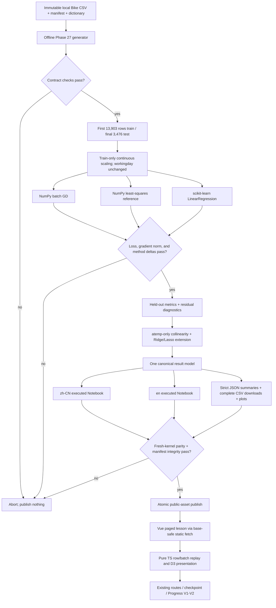

# Phase 27: Linear Regression Rebuild - Research

**Researched:** 2026-07-29  
**Domain:** Reproducible linear-regression pedagogy, offline Notebook assets, and held-out model diagnostics  
**Confidence:** HIGH

<user_constraints>
## User Constraints (from CONTEXT.md)

### Locked Decisions

### One Reproducible Bike Sharing Case

- **D-01:** Use the existing immutable local UCI Bike Sharing hourly snapshot as the sole primary dataset. Do not switch to LaDe or California Housing partway through the lesson.
- **D-02:** Predict raw hourly rental count `cnt` in the main teaching path so predictions, residuals, and errors retain their real unit. Add a concise `log1p(cnt)` comparison only to show how a target transform changes residual shape and coefficient interpretation.
- **D-03:** The canonical feature set is `temp`, `hum`, `windspeed`, `workingday`, and `hr`.
- **D-04:** Use `atemp` only in a controlled collinearity comparison. Explicitly exclude `casual` and `registered` and teach that they leak the target because `casual + registered = cnt`.
- **D-05:** Freeze one chronological split: the first 80% of rows for training and the final 20% for held-out testing. Every fitting method, page-visible result, Notebook result, and diagnostic must use the same membership.
- **D-06:** Preserve the existing UCI source, DOI, CC BY 4.0 attribution, local snapshot, manifest, data dictionary, row order, schema, and checksum contract. Runtime code and ordinary Notebook execution must remain offline.

### Eight-Chapter Teaching Spine

- **D-07:** Preserve all eight existing chapter IDs and deep links, but rewrite their order, titles, and responsibilities into one continuous Bike Sharing teaching path.
- **D-08:** Use a case-driven sequence: real question and row prediction, batch matrix prediction, residuals and MSE, batch gradient descent, three-method comparison, coefficient interpretation, held-out diagnosis, and the boundary of linear models.
- **D-09:** At every stage, show how scikit-learn obtains the corresponding prediction, metric, coefficient, or held-out result. Scikit-learn is a continuous practical counterpart, not a separate API-only chapter.
- **D-10:** Teach every mathematical step using the rhythm “one real row, then a batch”: one prediction to `X @ w + b`, one residual to a residual vector, and one sample’s gradient contribution to the batch mean.
- **D-11:** Keep polynomial behavior, overfitting, and regularization inside the continuous eight-chapter path, but use them as diagnostic extensions of the same Bike Sharing case. Do not introduce a second housing dataset.
- **D-12:** Detailed explanation remains dominant. Checkpoints and formative prompts stay selective and non-blocking; this phase does not add an exercise bank or assessment system.

### Three Fitting Methods

- **D-13:** Give each method one explicit role: NumPy batch gradient descent explains how parameters are learned; the normal equation supplies a non-iterative numerical reference; scikit-learn demonstrates practical fitting and continuously checks predictions, coefficients, and errors.
- **D-14:** Fit preprocessing on the training partition only. Standardize continuous inputs for all three methods with the same stored statistics, leave `workingday` binary, and use the identical transformed design matrix and intercept convention.
- **D-15:** Show coefficients in model space and translate them back into understandable original-unit effects. Formula symbols, TypeScript names, Python names, tables, and bilingual prose must share one notation contract.
- **D-16:** The primary three-method comparison is unregularized ordinary least squares. Ridge and Lasso appear only in the final stability extension, with an explicit statement that their objectives differ from OLS and therefore their coefficients are not expected to match it.
- **D-17:** The page shows representative predictions, coefficients, intercept, train/test metrics, and compact method deltas. The executed Notebook preserves the complete coefficient table, gradient-descent trace, stopping result, documented tolerances, and automated assertions; results outside tolerance must not be published.
- **D-18:** Carry forward the Phase 26 Notebook parity pattern: Chinese and English learner variants must derive from one executable code source, one dataset/split/environment, and identical numerical outputs.

### Residuals and Model Limitations

- **D-19:** Teach all three required limitation patterns with the real case: an hourly residual curve for nonlinearity, increasing residual spread at higher demand for heteroscedasticity, and coefficient instability after adding `atemp` for collinearity.
- **D-20:** Diagnose in two stages. First confirm that optimization has effectively finished using loss behavior, gradient norm, and three-method agreement; only then interpret persistent held-out residual patterns as model limitations.
- **D-21:** After the staged explanation, provide one compact combined diagnostic panel for review. It may aggregate convergence, method agreement, residual, and coefficient-stability signals, but it must not replace the earlier guided sequence.
- **D-22:** Demonstrate coefficient instability with a controlled comparison: keep rows, split, target, and preprocessing fixed; add only `atemp`; compare `temp`/`atemp` coefficients, held-out predictions, and errors; then show how Ridge changes coefficient stability.
- **D-23:** Default page content shows held-out MSE/MAE/R² and residual plots. Place three to five named real held-out records behind an expandable explanation for negative predictions, peak-demand underprediction, and unusually large residuals. Keep the complete residual output in downloadable assets.
- **D-24:** Give `log1p(cnt)` only a concise diagnostic comparison rather than duplicating the complete raw-target lesson.

### Inherited Product and Compatibility Constraints

- **D-25:** Preserve the `linear-regression` module ID, `/learn/linear-regression/*` routes, eight chapter IDs, checkpoint identity, Progress V1/V2 behavior, bilingual parity, safe Markdown/math rendering, code-copy behavior, GitHub Pages base paths, mobile layout, and reduced-motion fallback.
- **D-26:** Learner-facing copy should use plain terms such as “结果”, “观察”, “对照”, and “参考输出”; do not use “证据” as a front-end navigation label or unexplained teaching term.
- **D-27:** Keep fitting, preprocessing, prediction, residual, gradient, metric, coefficient-conversion, and diagnostic calculations outside Vue components and cover them with deterministic tests.
- **D-28:** Existing visual and Manim assets may be reused only when they remain numerically and semantically consistent with the Bike Sharing case. New media is need-driven, not a quota.

### the agent's Discretion

- Map the approved eight-part teaching sequence onto the preserved chapter IDs and choose the final bilingual chapter titles, provided every old deep link remains valid and the sequence is tested.
- Select representative row IDs, the exact chronological boundary timestamp, displayed coefficient units, plot ranges, and the three to five named held-out cases from the locked execution results.
- Select learning rate, epoch cap, stopping rule, condition handling, numerical tolerances, and finite guards after validating agreement among the three methods.
- Choose whether an existing illustration can be adapted or a new static/Manim asset is pedagogically necessary after the data-driven labs and Notebook plots are designed.

### Deferred Ideas (OUT OF SCOPE)

- A full leakage-safe preprocessing pipeline, controlled baseline improvement, and end-to-end housing project belong to Phase 28.
- Broader feature engineering with one-hot seasonal/weather variables and cyclical hour encoding belongs to the project or later model-improvement curriculum.
- Backend assessment, cloud progress, checkpoint persistence, and a large exercise bank remain outside this milestone.
</user_constraints>

<phase_requirements>
## Phase Requirements

| ID | Description | Research Support |
|----|-------------|------------------|
| LINR-01 | Learners can connect `ŷ = Xw + b`, residuals, MSE gradients, and coefficient interpretation using consistent notation. | Use one notation contract, a one-row-to-batch progression, pure TypeScript math functions, finite-difference gradient tests, and explicit model-space/original-unit conversion. [VERIFIED: `.planning/REQUIREMENTS.md` + local numerical analysis] |
| LINR-02 | Learners can reproduce a locked regression fit using NumPy batch gradient descent. | Use the frozen local snapshot, exact split index `13,903`, train-only population statistics, zero initialization, learning rate `0.1`, gradient-norm stopping at `1e-8`, and an executed trace that converges in `772` updates in the pinned environment. [VERIFIED: local dataset computation] |
| LINR-03 | Learners can compare normal-equation, gradient-descent, and scikit-learn coefficients, predictions, and errors on the same split. | Use one transformed matrix and intercept convention; implement the numerical reference with `numpy.linalg.lstsq`; publish coefficient/prediction deltas with `1e-6` absolute agreement assertions. [VERIFIED: local three-method computation] [CITED: https://numpy.org/doc/stable/reference/generated/numpy.linalg.lstsq.html] |
| LINR-04 | Learners can use held-out residuals and coefficient stability to identify nonlinearity, heteroscedasticity, or collinearity limitations. | Lock hourly residual summaries, prediction-bin residual spread, real named cases, and a base-versus-`atemp` coefficient comparison; show optimization agreement before diagnosing model form. [VERIFIED: local held-out diagnostic computation] |
</phase_requirements>

## Summary

Phase 27 should be planned as a content-and-output migration inside the existing linear-regression product shell, not as a new lesson system. The current module already owns eight durable chapter IDs, a paged route, checkpoint/progress integration, bilingual typed content, and a deterministic simulation boundary; the work is to replace synthetic/California-specific numerical authority with one locked Bike Sharing computation while preserving those contracts. [VERIFIED: codebase inspection + `27-CONTEXT.md`]

The canonical computation is sufficiently well conditioned for a clean teaching comparison. On the frozen first-80% training partition, unregularized OLS gives a model-space coefficient vector in canonical feature order `temp`, `hum`, `windspeed`, `workingday`, `hr` of approximately `[62.723891, -37.116416, 0.809446, 2.379719, 47.901434]` with intercept `173.010328`; batch gradient descent at learning rate `0.1` reaches gradient norm below `1e-8` after `772` updates and agrees with the least-squares reference to far better than the proposed `1e-6` publication tolerance. Held-out MSE/MAE/R² are approximately `40142.538619 / 135.296640 / 0.174252`, so method agreement is visibly compatible with weak held-out model fit—the exact distinction D-20 requires. [VERIFIED: local dataset computation]

Plan the deliverable around an offline generator that creates one numerical authority, two bilingual executed Notebooks, compact strict page summaries, complete downloadable tables, and a transactional manifest. The browser should render/replay locked full-data results and use pure TypeScript for bounded interactions; it should not fetch UCI remotely, execute Python, invert matrices, or independently invent another full-data fit. [VERIFIED: Phase 26 asset pattern + `AGENTS.md` + `27-CONTEXT.md`]

**Primary recommendation:** Reuse the Phase 26 offline asset/parity architecture, add a Phase 27 pure-math/strict-asset boundary, and rebuild the eight existing chapters around one frozen matrix, one fit, and one staged diagnosis. [VERIFIED: codebase and constraint synthesis]

## Architectural Responsibility Map

| Capability | Primary Tier | Secondary Tier | Rationale |
|------------|-------------|----------------|-----------|
| Immutable Bike Sharing identity, split membership, preprocessing statistics, fitted outputs, and complete residual tables | Build-time offline Python pipeline | Static assets | Python/NumPy/scikit-learn execute the full locked dataset once; manifests and tests make those results auditable and offline at learner runtime. [VERIFIED: Phase 26 pattern + D-05/D-06/D-17/D-18] |
| Prediction, residual, MSE, gradients, metric formulas, coefficient conversion, and bounded interactive replay | Browser/client pure TypeScript domain layer | Build-time parity checks | Calculations stay outside Vue and are deterministic; parity fixtures tie browser behavior to the locked output rather than creating a second authority. [VERIFIED: `AGENTS.md` + D-27] |
| Eight-chapter narrative, controls, plots, expandable named cases, downloads, mobile and reduced-motion presentation | Browser/client Vue components | Static assets | Existing paged components own composition and interaction, while data/math remain in typed modules and utilities. [VERIFIED: codebase inspection] |
| Routes, deep links, checkpoint identity, curriculum adapters, Progress V1/V2 | Browser/client integration layer | — | Existing compatibility contracts must remain unchanged; only chapter order/title/responsibility changes. [VERIFIED: route/adapter/test inspection + D-25] |
| Dataset CSV, manifest/dictionary, bilingual Notebooks, JSON summaries, CSV downloads, plots, environment/asset manifests | CDN/static public assets | Build-time offline Python pipeline | Public assets are immutable, base-path safe, cacheable, downloadable, and do not require a service boundary. [VERIFIED: repository public-asset conventions] |

## Project Constraints (from AGENTS.md)

- Keep Vue 3 + TypeScript + Vite, Pinia/Vue Router, D3/Three.js/Manim, KaTeX/markdown-it/sanitize-html, and the Node test runner; do not introduce a UI framework. [VERIFIED: `AGENTS.md`]
- Use the existing typed schemas and provide both `'zh-CN'` and `en` for every `LocalizedCopy`; preserve the learning loop from question through concept, visual/experiment, numerical/code connection, misconception feedback, checkpoint, and next step. [VERIFIED: `AGENTS.md`]
- Keep formula variables, code identifiers, experiment controls, and prose consistent; quiz feedback must explain the reason and point learners back to a relevant visual or section. [VERIFIED: `AGENTS.md`]
- Prefer `<script setup lang="ts">`; keep core fitting and diagnostic logic in `src/simulations/`, `src/modules/*/utils/`, or `src/utils/`, not in templates or oversized page components. [VERIFIED: `AGENTS.md`]
- Preserve lazy route imports and reuse the existing `LinearRegressionPagedLesson`, lab, results, checkpoint, code, and safe math/Markdown patterns. [VERIFIED: `AGENTS.md` + codebase inspection]
- Use deterministic D3/SVG/Canvas derivations independent of DOM work; if any Three.js asset is retained, it must use the existing lifecycle controller, release all resources/listeners/frames, and have mobile/low-performance fallback. [VERIFIED: `AGENTS.md`]
- Use leading-slash public paths through `withPublicBase` or the adjacent established helper; never depend on local absolute paths, temporary paths, or remote runtime images/data. [VERIFIED: `AGENTS.md`]
- Preserve mobile readability, keyboard-operable labeled/resettable controls, non-color status cues, high contrast, reduced-motion behavior, and non-animated access to every essential teaching fact. [VERIFIED: `AGENTS.md`]
- Render Markdown/math only through `src/utils/markdownMath.ts` or its safe wrapper; never emit unsanitized raw HTML, scripts, inline handlers, or uncontrolled iframes. Bound user inputs and handle NaN/Infinity with understandable feedback. [VERIFIED: `AGENTS.md`]
- Add deterministic tests for math, transforms, scoring, simulation, routes, structure, assets, bilingual content, sanitizer/public-base behavior, and lifecycle/fallback behavior as applicable; run `npm test`, `npm run build`, `npm run build:pages`, and `npm run security:audit` in proportion to the changes. [VERIFIED: `AGENTS.md`]
- Preserve unrelated dirty files and generated images; do not perform destructive Git operations or fold this phase into a multi-phase rewrite. Each Curriculum V2 phase must remain independently validated and shippable. [VERIFIED: `AGENTS.md`]

## Standard Stack

### Core

| Library / facility | Locked version | Publish date | Purpose | Why Standard Here |
|--------------------|----------------|--------------|---------|-------------------|
| Vue | `3.5.31` | Existing project lock | Existing eight-chapter client shell and interactive composition | Already installed and wired to the course/router/progress contracts; no replacement is needed. [VERIFIED: `package-lock.json` + codebase inspection] |
| TypeScript | `5.9.3` | Existing project lock | Typed content, strict asset parsers, pure browser math | Existing project language and build contract. [VERIFIED: `package-lock.json` + `AGENTS.md`] |
| NumPy | `2.4.6` | 2026-05-18 | Arrays, batch gradient descent, metrics, and `lstsq` numerical reference | Exact version is already pinned and present in the audited local wheelhouse; `lstsq` solves least-squares systems without explicit Gram-matrix inversion. [VERIFIED: local wheelhouse + PyPI release JSON] [CITED: https://numpy.org/doc/stable/reference/generated/numpy.linalg.lstsq.html] |
| pandas | `3.0.3` | 2026-05-11 | Load the locked CSV and emit auditable tables | Exact version is already pinned in the inherited Notebook environment. [VERIFIED: local wheelhouse + PyPI release JSON] |
| scikit-learn | `1.9.0` | 2026-06-02 | `LinearRegression`, `StandardScaler`, metrics, Ridge/Lasso counterpart | Exact version is already pinned; official APIs cover the practical model, train-only transform, metrics, and regularized stability extension. [VERIFIED: local wheelhouse + PyPI release JSON] [CITED: https://scikit-learn.org/stable/modules/generated/sklearn.linear_model.LinearRegression.html] |

### Supporting

| Library / facility | Locked version | Publish date | Purpose | When to Use |
|--------------------|----------------|--------------|---------|-------------|
| SciPy | `1.17.1` | 2026-02-23 | Transitive numerical backend used by scikit-learn dense least squares | Retain the existing pin; do not call a separate solver in lesson code. [VERIFIED: local wheelhouse + PyPI release JSON] |
| nbformat | `5.10.4` | 2024-04-04 | Build the two learner Notebooks from one code source | Generator-only. [VERIFIED: local wheelhouse + PyPI release JSON] |
| nbclient | `0.11.0` | 2026-06-05 | Execute each Notebook in a fresh kernel and capture outputs | Generator/verification-only. [VERIFIED: local wheelhouse + PyPI release JSON] [CITED: https://nbclient.readthedocs.io/en/latest/client.html] |
| JupyterLab | `4.6.1` | 2026-06-29 | Learner/editor environment documented by the bundle | Retain the exact inherited environment pin; not a browser runtime dependency. [VERIFIED: local wheelhouse + PyPI release JSON] |
| ipykernel | `7.3.0` | 2026-06-10 | Fresh-kernel execution for parity proofs | Required by the isolated build environment, not by the Vue app. [VERIFIED: local wheelhouse + PyPI release JSON] |
| D3 | `7.9.0` | Existing project lock | Deterministic residual, convergence, and coefficient plots | Use the already-installed package when an interactive SVG adds teaching value; derive plot data in pure functions first. [VERIFIED: `package-lock.json` + `AGENTS.md`] |
| Shared safe-render/public-path utilities | Repository code | — | Safe formulas/Markdown and GitHub Pages URL resolution | Required for all page copy and downloads. [VERIFIED: `AGENTS.md` + codebase inspection] |

### Alternatives Considered

| Instead of | Could Use | Tradeoff |
|------------|-----------|----------|
| `numpy.linalg.lstsq` | Explicit `(AᵀA)⁻¹Aᵀy` | Keep the inverse only as a conceptual formula; explicit inversion amplifies conditioning problems and is unnecessary. [CITED: https://numpy.org/doc/stable/reference/generated/numpy.linalg.inv.html] |
| Locked build-time results plus pure TS replay | Fit all 17,379 rows independently in the browser | A second full-data implementation creates parity, performance, and authority drift without serving a locked decision. [VERIFIED: D-17/D-18/D-27 + Phase 26 pattern] |
| Static D3/SVG plots and existing components | New Three.js/Manim media | Add media only after data-driven plots reveal a specific unmet teaching need; every retained asset must match the Bike numbers. [VERIFIED: D-28 + `AGENTS.md`] |

**Installation:** No new package installation is part of Phase 27. Reuse the existing exact requirements and the local `batch-4-wheelhouse`; an offline environment rebuild should use the repository's established wheelhouse command/pattern and must not resolve newer versions. [VERIFIED: Phase 25/26 environment contracts + local wheelhouse inspection]

**Version verification:** All eight Python pins were found in the existing requirements, local wheelhouse manifest, active repository environment or official PyPI release metadata. The release dates above come from version-specific PyPI JSON responses fetched on 2026-07-29. [VERIFIED: local environment + PyPI registry]

## Package Legitimacy Audit

Phase 27 introduces **no new external package**. The legitimacy seam nevertheless classified every inherited Python pin as `SUS` because its automated registry signals lacked sufficient download/source/age assurance (and several versions are recent). These are existing repository-audited, hash-manifested wheelhouse artifacts, not permission to download or upgrade them. If planning changes any pin or installs from a registry, insert `checkpoint:human-verify` before that action. [VERIFIED: `package-legitimacy check` output + local wheelhouse manifest]

| Package | Registry | Release age on 2026-07-29 | Source Repo | Seam verdict | Disposition |
|---------|----------|---------------------------|-------------|--------------|-------------|
| `numpy==2.4.6` | PyPI | ~72 days | `github.com/numpy/numpy` | SUS | Reuse locked local wheel only; registry install/upgrade requires human verification. [VERIFIED: PyPI JSON + legitimacy seam] |
| `pandas==3.0.3` | PyPI | ~79 days | `github.com/pandas-dev/pandas` | SUS | Reuse locked local wheel only; registry install/upgrade requires human verification. [VERIFIED: PyPI JSON + legitimacy seam] |
| `scipy==1.17.1` | PyPI | ~156 days | `github.com/scipy/scipy` | SUS | Reuse locked local wheel only; registry install/upgrade requires human verification. [VERIFIED: PyPI JSON + legitimacy seam] |
| `scikit-learn==1.9.0` | PyPI | ~57 days | `github.com/scikit-learn/scikit-learn` | SUS | Reuse locked local wheel only; registry install/upgrade requires human verification. [VERIFIED: PyPI JSON + legitimacy seam] |
| `nbformat==5.10.4` | PyPI | ~847 days | `github.com/jupyter/nbformat` | SUS | Reuse locked local wheel only; registry install/upgrade requires human verification. [VERIFIED: PyPI JSON + legitimacy seam] |
| `nbclient==0.11.0` | PyPI | ~54 days | `github.com/jupyter/nbclient` | SUS | Reuse locked local wheel only; registry install/upgrade requires human verification. [VERIFIED: PyPI JSON + legitimacy seam] |
| `jupyterlab==4.6.1` | PyPI | ~30 days | `github.com/jupyterlab/jupyterlab` | SUS | Reuse locked local wheel only; registry install/upgrade requires human verification. [VERIFIED: PyPI JSON + legitimacy seam] |
| `ipykernel==7.3.0` | PyPI | ~49 days | `github.com/ipython/ipykernel` | SUS | Reuse locked local wheel only; registry install/upgrade requires human verification. [VERIFIED: PyPI JSON + legitimacy seam] |

**Packages removed due to SLOP verdict:** none. [VERIFIED: legitimacy seam]  
**Packages flagged as suspicious [SUS]:** all eight inherited Python pins; no new installation is recommended. [VERIFIED: legitimacy seam]

## Architecture Patterns

### System Architecture Diagram



The build pipeline is the numerical publication boundary; the browser is the teaching and bounded-interaction boundary. Failure at dataset, finite-value, agreement, parity, or manifest gates must leave the previous published asset set intact. [VERIFIED: D-05/D-06/D-17/D-18 + Phase 26 publish pattern]

### Recommended Project Structure

```text
src/
├── data/
│   ├── linearRegressionModule.ts       # preserved typed module; rewritten bilingual case spine
│   └── linearRegressionAssets.ts       # typed paths, strict schemas, and asset parsers
├── simulations/
│   ├── linearRegression.ts             # stable public imports / composition boundary
│   └── linearRegressionBike.ts         # pure feature, prediction, loss, GD, metric, diagnostic math
└── components/
    ├── LinearRegressionPagedLesson.vue # existing routing/layout shell
    ├── LinearRegressionLessonLab.vue   # state composition and bounded controls
    └── LinearRegressionResults.vue     # locked result and diagnostic presentation
scripts/
└── linear-regression/
    └── build-phase-27-assets.py         # one source → two executed Notebooks + outputs
public/
└── notebooks/linear-regression/
    ├── bike-linear-regression.zh-CN.ipynb
    ├── bike-linear-regression.en.ipynb
    ├── linear-regression-summary.json
    ├── gradient-descent-trace.csv
    ├── coefficients.csv
    ├── heldout-residuals.csv
    ├── output-manifest.json
    └── requirements.txt / environment contract
tests/
├── linear-regression-math.test.ts
├── linear-regression-assets.test.ts
├── linear-regression-notebook-assets.test.ts
├── linear-regression-simulation.test.ts
└── linear-regression-layout.test.mjs
```

The exact filenames may follow adjacent Phase 26 conventions, but responsibilities must stay separated: full-data fitting/generation in Python, pure replay/derivation in TypeScript, and no substantive numerical implementation in Vue. [VERIFIED: repository patterns + D-27]

### Component Responsibilities

| Component | Responsibility | Must Not Own |
|-----------|----------------|--------------|
| Offline generator | Validate source hash/schema/order, split, preprocess, fit, diagnose, build both locales, execute clean kernels, compare outputs, stage and atomically publish | Network fetches, locale-specific duplicated code, partial publication. [VERIFIED: D-06/D-17/D-18] |
| `linearRegressionBike.ts` | Canonical feature order/types; finite guards; row/batch prediction; residual/MSE/gradient; coefficient-unit conversion; metric/diagnostic reducers; trace replay | DOM, fetch, localized prose, a competing full-data result source. [VERIFIED: D-27 + `AGENTS.md`] |
| `linearRegressionAssets.ts` | Base-safe asset paths, strict versioned schemas, exact keys/order/finite checks, fallback state | Silent coercion of malformed data. [VERIFIED: adjacent `lossFunctionsAssets.ts` and `pythonDataToolsOutputs.ts`] |
| Vue lesson/lab/results | Route-derived chapter state, controls, narration, accessibility, responsive plots, expanders/downloads | Fitting, preprocessing, metric formulas, coefficient conversion, raw `fetch` paths. [VERIFIED: `AGENTS.md`] |
| Existing route/catalog/progress layer | Preserve module/chapter/checkpoint identities and lazy loading | Renaming/deleting IDs or storage sources. [VERIFIED: D-25 + Curriculum V2 guards] |

### Pattern 1: One Numerical Contract Across Three Methods

Define the model matrix once in the canonical order `temp`, `hum`, `windspeed`, `workingday`, `hr`. Split before fitting statistics; standardize the four continuous features using training population mean/scale (`ddof=0`), leave `workingday` unchanged, and store both transformed matrix and preprocessing metadata. Batch GD keeps `b` separate; the reference augments a ones column and calls `np.linalg.lstsq`; scikit-learn receives the same five-column transformed matrix with `fit_intercept=True`. [VERIFIED: local numerical analysis + D-03/D-05/D-14] [CITED: https://scikit-learn.org/stable/modules/generated/sklearn.preprocessing.StandardScaler.html]

The training/test contract is:

| Item | Locked value |
|------|--------------|
| Total rows | `17,379` [VERIFIED: local CSV + repository manifest] |
| Train membership | indices `[0, 13,903)` / first `13,903` rows [VERIFIED: local dataset computation] |
| Test membership | indices `[13,903, 17,379)` / final `3,476` rows [VERIFIED: local dataset computation] |
| Boundary | train ends at `instant=13903`, `2012-08-07 11:00`; test starts at `instant=13904`, `2012-08-07 12:00` [VERIFIED: local dataset computation] |
| Snapshot SHA-256 | `e03de4ee4ef4dc376ac6e04bf829673c6269e8eba5c60fa121640fa2f829504f` [VERIFIED: local hash + repository manifest] |
| Target | raw `cnt`; no clipping of negative OLS predictions [VERIFIED: D-02 + diagnostic synthesis] |
| Continuous means | `temp=0.4991699633`, `hum=0.6229957563`, `windspeed=0.1940965907`, `hr=11.5465726822` [VERIFIED: local dataset computation] |
| Continuous population scales | `temp=0.1977090288`, `hum=0.1981871966`, `windspeed=0.1230187786`, `hr=6.9119866040` [VERIFIED: local dataset computation] |

Do not round the split to a date boundary: D-05 locks row membership, and the 80% boundary falls within one day. [VERIFIED: local dataset computation + D-05]

### Pattern 2: One Row, Then the Batch

Use residual sign `r = ŷ - y` everywhere. For one real row, show `ŷᵢ = xᵢᵀw + b`, `rᵢ = ŷᵢ - yᵢ`, and unaveraged contributions `2rᵢxᵢ` and `2rᵢ`; then generalize to `ŷ = Xw + b1`, `MSE = rᵀr/n`, `∇w = 2Xᵀr/n`, and `∂MSE/∂b = 2·1ᵀr/n`. [VERIFIED: analytical derivation + D-10]

The plan should lock one representative training row after generation and carry its exact identifier, transformed values, prediction, residual, loss contribution, and gradient contribution through the first four chapters. Tests must assert that row-level contributions reduce to the batch formulas. [VERIFIED: D-10/D-17 synthesis]

### Pattern 3: Optimization Gate Before Model Diagnosis

Publish model diagnostics only after proving that the optimizer is no longer the likely explanation. The candidate locked GD contract is zero initialization, learning rate `0.1`, maximum `5,000` updates, finite checks on every trace point, and stop when the full gradient norm is at most `1e-8`; the pinned local computation stops after `772` updates. Require maximum absolute coefficient and held-out-prediction disagreement of at most `1e-6` between GD and the least-squares/scikit-learn references. [VERIFIED: local numerical validation]

Reference anchors for the publication test:

| Quantity | NumPy least-squares / sklearn anchor |
|----------|--------------------------------------|
| Model-space coefficients (`temp`, `hum`, `windspeed`, `workingday`, `hr`) | `[62.7238909530, -37.1164156021, 0.8094458662, 2.3797186778, 47.9014338433]` [VERIFIED: local dataset computation] |
| Model-space intercept | `173.0103284947` [VERIFIED: local dataset computation] |
| Train MSE / MAE / R² | `18105.236540 / 98.800052 / 0.350417` [VERIFIED: local dataset computation] |
| Test MSE / MAE / R² | `40142.538619 / 135.296640 / 0.174252` [VERIFIED: local dataset computation] |
| GD stop | update `772`, gradient norm `9.96e-9` [VERIFIED: local dataset computation] |
| Max GD-to-reference coefficient delta | about `2.8e-8` [VERIFIED: local dataset computation] |
| Max sklearn-to-reference coefficient delta | about `5.1e-13` [VERIFIED: local dataset computation] |
| Transformed design condition number | about `3.33` [VERIFIED: local dataset computation] |

Treat displayed decimal rounding separately from assertion precision. The manifest should retain full precision; page copy may use readable rounded values derived from the locked summary. [VERIFIED: Phase 26 output-authority pattern]

### Pattern 4: Dual-Space Coefficient Interpretation

For each standardized continuous feature `zⱼ=(xⱼ-μⱼ)/σⱼ`, convert a model-space coefficient with `βⱼ=wⱼ/σⱼ`; retain the binary `workingday` coefficient unchanged; compute `b_original = b_model - Σ(wⱼ μⱼ/σⱼ)` over the standardized features. [VERIFIED: algebraic derivation]

Using the repository data dictionary, candidate original dataset-unit coefficients are approximately: `temp=317.2535`, `hum=-187.2796`, `windspeed=6.5799`, `workingday=2.3797`, `hr=6.9302`, intercept `50.0241`. If the UI translates normalized fields to physical labels, it must use the local dictionary contract and state the conditional/additive model interpretation; these are associations within a misspecified linear model, not causal effects. [VERIFIED: local coefficient conversion + repository dictionary]

### Pattern 5: Staged Real-Case Diagnostics

Use held-out residuals with the same sign `prediction - actual`. The local fit already yields a pronounced hour pattern: mean residual near hour `8` is about `-367.4`, near hour `17` about `-366.6`, and near hour `23` about `+118.1`, demonstrating that a single linear `hr` effect misses the daily shape. [VERIFIED: local held-out computation]

For spread, bin by held-out prediction quartile and show both residual standard deviation and MAE. Candidate residual standard deviations rise from about `136.0` in the lowest prediction bin to `209.2` in the highest, while MAE rises from about `78.4` to `181.7`. Describe this as widening residual spread consistent with heteroscedasticity, not as a causal or formal proof; functional-form misspecification can also structure residuals. [VERIFIED: local held-out computation] [CITED: https://www.itl.nist.gov/div898/handbook/pmd/section4/pmd442.htm]

For collinearity, add only `atemp`. Its training correlation with `temp` is about `0.99238`; the transformed design condition number rises from about `3.33` to `17.24`; OLS allocates approximately `14.34` to `temp` and `48.80` to `atemp` instead of the base model's single `temp` coefficient `62.72`, while held-out MSE remains close (`40092.50` versus `40142.54`). A candidate Ridge stability comparison at `alpha=300` reduces sensitivity to a small deterministic target perturbation from coefficient-vector L2 change `0.0278` to `0.00914`; lock the exact perturbation and alpha in generated outputs before publication. [VERIFIED: local collinearity computation] [CITED: https://scikit-learn.org/stable/modules/linear_model.html]

### Pattern 6: One Source, Two Executed Notebook Variants

Construct locale-specific Markdown from typed translation data but inject byte-identical code cells, execute each Notebook in a fresh kernel against the same local CSV/environment, normalize nondeterministic metadata, and compare numerical outputs. The generator should reject network/pip/shell execution, missing/extra cells, stale checksums, nonfinite values, method tolerance failures, or locale output drift before staging publication. [VERIFIED: Phase 26 generator/test inspection + D-18]

### Eight-Chapter Mapping

| Order | Preserved ID | Recommended responsibility |
|-------|--------------|----------------------------|
| 1 | `fit-line` | Real hourly-demand question, leakage guard, one real row, `ŷ=xᵀw+b`, sklearn counterpart. [VERIFIED: D-07/D-08/D-10 synthesis] |
| 2 | `multivariate` | Canonical feature vector, train-only scaling, batch matrix prediction, split identity. [VERIFIED: D-03/D-05/D-14 synthesis] |
| 3 | `residual-loss` | One residual to residual vector, MSE, analytical and finite-difference gradient connection. [VERIFIED: LINR-01 synthesis] |
| 4 | `training-motion` | NumPy batch GD trace, learning rate/stopping/finite guards, practical sklearn comparison. [VERIFIED: D-13/D-20 synthesis] |
| 5 | `polynomial` | Three-method OLS agreement and a concise same-case polynomial diagnostic extension; preserve the old ID even though the bilingual title/responsibility changes. [VERIFIED: D-07/D-11/D-13 synthesis] |
| 6 | `model-limits` | Model-space to original-unit coefficients, intercept, conditional interpretation, representative predictions. [VERIFIED: D-15/D-17 synthesis] |
| 7 | `overfitting` | Held-out MSE/MAE/R², hourly curve, spread bins, named records, concise raw-versus-`log1p` comparison. [VERIFIED: D-19/D-23/D-24 synthesis] |
| 8 | `regularization` | Add-only-`atemp` instability, different Ridge/Lasso objectives, compact combined review panel, linear-model boundary and Phase 28 next step. [VERIFIED: D-16/D-21/D-22 synthesis] |

The chapter array, curriculum adapter expectations, route manifest, progress tests, and sidebar/pager tests must agree on this order while preserving all eight literal IDs. [VERIFIED: codebase inspection + D-25]

### Anti-Patterns to Avoid

- **Independent page and Notebook fits:** They can agree today and drift later; page-visible anchors must come from the published result model and parity tests. [VERIFIED: D-17/D-18]
- **Explicit normal-equation inverse:** `inv(XᵀX)` is less robust than a least-squares solver and obscures rank information. [CITED: https://numpy.org/doc/stable/reference/generated/numpy.linalg.inv.html]
- **Preprocessing before the split:** It leaks held-out distribution information; split first, fit scaler on training, transform both partitions. [CITED: https://scikit-learn.org/stable/common_pitfalls.html]
- **Clipping negative predictions:** This silently changes predictions and metrics; keep them and explain them as a linear-model limitation. [VERIFIED: local diagnostic synthesis + D-23]
- **Calling Ridge/Lasso agreement failures:** Their objectives differ from OLS by design; only the three unregularized methods share the primary agreement gate. [VERIFIED: D-16] [CITED: https://scikit-learn.org/stable/modules/linear_model.html]
- **Treating method agreement as model adequacy:** Agreement proves the optimization/reference implementation, not that linear residual assumptions hold. [VERIFIED: D-20 + local diagnostics]
- **Runtime UCI access:** The course and ordinary Notebooks must read the locked local snapshot only. [VERIFIED: D-06]
- **Using live UCI normalization text as numeric authority:** The repository manifest and bilingual dictionary are the frozen Phase 27 contract; live metadata is attribution/semantic context only. [VERIFIED: local source comparison + D-06] [CITED: https://archive.ics.uci.edu/dataset/275/bike+sharing+dataset]

## Don't Hand-Roll

| Problem | Don't Build | Use Instead | Why |
|---------|-------------|-------------|-----|
| OLS numerical reference | A matrix inverse or home-grown Gaussian elimination | `numpy.linalg.lstsq(A, y, rcond=None)` | Handles least-squares/rank cases and returns residual/rank/singular diagnostics. [CITED: https://numpy.org/doc/stable/reference/generated/numpy.linalg.lstsq.html] |
| Practical model counterpart | A browser clone labeled “sklearn” | `sklearn.linear_model.LinearRegression` in the executed Notebook | Gives the actual API/attributes learners are meant to reproduce and compare. [CITED: https://scikit-learn.org/stable/modules/generated/sklearn.linear_model.LinearRegression.html] |
| Scaling | Recomputed locale/page-specific means or test-inclusive statistics | One stored training-only scaler contract | Prevents leakage and feature-order/statistic drift. [CITED: https://scikit-learn.org/stable/common_pitfalls.html] |
| Metrics | Rounded inline Vue expressions | Pure tested reducers plus sklearn parity | Preserves residual sign, denominator, finite handling, and display consistency. [VERIFIED: D-27 + repository architecture] |
| Notebook execution | Shelling into ad-hoc Jupyter state | Existing `nbclient` fresh-kernel generator pattern | Makes execution, errors, outputs, and parity machine-verifiable. [CITED: https://nbclient.readthedocs.io/en/latest/client.html] |
| Dataset integrity | A second CSV parser/hash convention | Existing Bike Sharing contract, manifest, dictionary, and checksum utilities | Avoids conflicting row/schema/source authority. [VERIFIED: `scripts/python-data-tools/bikeSharingContract.mjs` + related tests] |
| Safe lesson rendering and base paths | Raw HTML or literal deployment URLs | Existing Markdown/math sanitizer and `withPublicBase` patterns | Required for XSS safety and GitHub Pages. [VERIFIED: `AGENTS.md`] |
| Asset publication | Copying files one by one into `public/` | Phase 26 candidate/staging/rollback transaction | Prevents a mixed-generation public bundle. [VERIFIED: Phase 26 generator inspection] |

**Key insight:** Hand-rolled teaching math is appropriate only for the deliberately transparent batch-GD implementation and small pure TypeScript derivations; numerical reference solving, scaling contracts, notebook execution, sanitization, hashing, and publication integrity already have standard or repository-owned solutions. [VERIFIED: phase scope + official APIs + codebase patterns]

## Runtime State Inventory

Although Phase 27 preserves names rather than renaming them, it migrates the numerical/content authority of an existing live module. The runtime audit therefore covers all five migration-state categories explicitly. [VERIFIED: phase scope + runtime-state audit]

| Category | Items Found | Action Required |
|----------|-------------|-----------------|
| Stored data | Browser progress may contain `linear-regression` completion/attempt/last-visited state in `ml-atlas:algorithm-progress:v1` and `ml-atlas:learning-progress:v2` plus its migration marker. Locale state is separate. [VERIFIED: `src/utils/algorithmProgress.ts` + `src/curriculum/progress.ts` + `src/i18n/index.ts`] | **No data migration.** Preserve the module ID, checkpoint identity, and all eight lesson IDs/routes so existing records remain readable; add regression tests proving V1/V2 records survive the rebuild. [VERIFIED: D-25 + Curriculum V2 guards] |
| Live service config | None — the Phase 27 learner path is a static Vite/GitHub Pages client with local public assets; no repository-visible backend workflow, database-held configuration, or external model service owns these lesson values. [VERIFIED: route/build/config inspection] | No service/API patch. Keep runtime asset access offline and base-path safe. [VERIFIED: D-06/D-25] |
| OS-registered state | None — repository search found no launchd plist, systemd unit, pm2 ecosystem file, scheduled task definition, or global CLI registration for this module. [VERIFIED: filesystem audit] | None. [VERIFIED: filesystem audit] |
| Secrets/env vars | None specific to `linear-regression`; no phase calculation reads a secret or phase-named environment variable, and no checked environment file references the module. [VERIFIED: code/environment-file audit] | None. The offline generator must not add network credentials. [VERIFIED: D-06 + Phase 26 pattern] |
| Build artifacts / installed packages | `dist/` exists and will be stale after source changes; existing public files under `public/manim/linear-regression/` and `public/linear-regression/generated/` encode the old teaching case; `node_modules/` and the Notebook wheelhouse are installed caches. [VERIFIED: filesystem audit] | Regenerate `dist/` only through build gates and never commit it; semantically audit each legacy media reference and leave unused files untouched unless a scoped cleanup is planned. Reuse installed dependency contracts without renaming or upgrading them. [VERIFIED: D-28 + `AGENTS.md`] |

**Canonical migration conclusion:** updating repository files is sufficient only if identity tests protect stored progress and generated/public result assets are republished atomically; no database, service UI, OS registration, or secret-key migration remains. [VERIFIED: five-category runtime audit]

## Common Pitfalls

### Pitfall 1: Feature or Intercept Convention Drift

**What goes wrong:** Methods appear to disagree because one matrix uses a different feature order, standardizes `workingday`, or contains an explicit ones column while sklearn also fits an intercept. [VERIFIED: local method-parity analysis]  
**How to avoid:** Version the canonical feature tuple, store preprocessing metadata, keep GD `b` separate, use an augmented matrix only inside `lstsq`, and use `LinearRegression(fit_intercept=True)` on the unaugmented transformed features. [VERIFIED: validated computation contract]  
**Warning signs:** Coefficients are permuted, intercept deltas are large, or predictions agree only after manual reordering. [VERIFIED: numerical invariant analysis]

### Pitfall 2: Leakage by Feature or Preprocessing

**What goes wrong:** `casual`/`registered` recreate `cnt`, or test rows influence scaling. [VERIFIED: local CSV relationship check + D-04]  
**How to avoid:** Reject leakage columns in the generator/schema and fit all preprocessing on the first `13,903` rows only. [VERIFIED: D-04/D-05/D-14]  
**Warning signs:** Implausibly perfect held-out metrics or scaler statistics that change when test rows are removed. [VERIFIED: diagnostic reasoning]

### Pitfall 3: Residual Sign or Metric Denominator Changes

**What goes wrong:** Plots and gradient formulas use opposite residual signs, or MSE uses sum/`n-1` in one runtime. [VERIFIED: formula consistency analysis]  
**How to avoid:** Lock `residual = prediction - actual`, MSE divisor `n`, and analytical/finite-difference parity fixtures in both Python and TypeScript. [VERIFIED: LINR-01 synthesis]  
**Warning signs:** Gradients point uphill or page residual labels invert the downloadable CSV. [VERIFIED: formula behavior]

### Pitfall 4: Solving the Optimizer but Hiding the Model Failure

**What goes wrong:** The course stops at three-method agreement, or diagnoses residual shape before showing convergence. [VERIFIED: D-19/D-20]  
**How to avoid:** Gate diagnosis behind trace/gradient/delta results, then show the persistent hour curve and widening spread. [VERIFIED: local diagnostics + D-20]  
**Warning signs:** Learners are told to tune learning rate when the solver already matches OLS, or method deltas are absent from the page. [VERIFIED: teaching-sequence reasoning]

### Pitfall 5: Misreading Coefficients

**What goes wrong:** Model-space standardized coefficients are described as raw feature-unit changes, normalized UCI fields are presented as physical units without conversion, or coefficients are called causal. [VERIFIED: local dictionary/coefficient audit]  
**How to avoid:** Label model space and original/dictionary space separately, show the algebra, and state “holding modeled features fixed” plus the noncausal limitation. [VERIFIED: D-15 synthesis]  
**Warning signs:** The same coefficient value appears under both unit labels or bilingual prose uses different symbols. [VERIFIED: consistency invariant]

### Pitfall 6: Comparing `log1p` Results on the Wrong Scale

**What goes wrong:** Log-space metrics or coefficients are placed beside raw-count results as if the objective/unit were identical. [VERIFIED: local target-transform computation]  
**How to avoid:** Keep the main path raw; inverse-transform predictions before count-scale metrics and explain that `log1p` changes both objective and coefficient interpretation. [CITED: https://numpy.org/doc/stable/reference/generated/numpy.log1p.html] [CITED: https://scikit-learn.org/stable/modules/compose.html]  
**Warning signs:** The concise comparison claims improvement from a smaller log-space MSE or describes log coefficients as rental-count increments. [VERIFIED: scale analysis]

### Pitfall 7: Overstating Heteroscedasticity or Collinearity

**What goes wrong:** A widening plot is presented as causal proof, or adding `atemp` changes more than one factor and makes the stability comparison uninterpretable. [VERIFIED: diagnostic-design analysis]  
**How to avoid:** Use descriptive wording, pair spread with hourly misspecification, and change only `atemp` before the separately labeled Ridge objective. [VERIFIED: D-19/D-22] [CITED: https://www.itl.nist.gov/div898/handbook/pmd/section4/pmd44.htm]  
**Warning signs:** Rows/split/preprocessing/target change between coefficient tables, or no prediction/error comparison accompanies coefficient movement. [VERIFIED: controlled-comparison invariant]

### Pitfall 8: Locale, Asset, or Deployment Drift

**What goes wrong:** Chinese/English Notebooks contain different code or numbers, a failed generation partially replaces public files, or downloads work at `/` but fail under GitHub Pages base paths. [VERIFIED: Phase 26 failure modes + `AGENTS.md`]  
**How to avoid:** Generate both locales from one source, run fresh-kernel normalized-output parity, publish transactionally, and resolve every public URL through the shared helper. [VERIFIED: Phase 26 pattern]  
**Warning signs:** Different code-cell hashes, stale output-manifest entries, untracked absolute paths, or `fetch('/...')` bypassing the helper. [VERIFIED: repository asset-contract tests]

## Code Examples

Verified patterns from official sources and the locally validated numerical contract:

### Pure Prediction, Residual, MSE, and Gradient

```ts
export function mseGradient(
  rows: readonly (readonly number[])[],
  targets: readonly number[],
  weights: readonly number[],
  intercept: number,
) {
  if (rows.length === 0 || rows.length !== targets.length) {
    throw new Error('invalid regression batch')
  }

  const residuals = rows.map((row, i) =>
    row.reduce((sum, value, j) => sum + value * weights[j], intercept)
      - targets[i],
  )
  const scale = 2 / rows.length
  const weightGradient = weights.map((_, j) =>
    scale * residuals.reduce((sum, residual, i) => sum + residual * rows[i][j], 0),
  )
  const interceptGradient =
    scale * residuals.reduce((sum, residual) => sum + residual, 0)
  const mse =
    residuals.reduce((sum, residual) => sum + residual * residual, 0)
    / rows.length

  if (![mse, interceptGradient, ...weightGradient].every(Number.isFinite)) {
    throw new Error('non-finite regression state')
  }
  return { residuals, mse, weightGradient, interceptGradient }
}
```

This is the direct implementation of the locked residual/MSE derivative convention; tests should compare selected coordinates with central finite differences and the generated Python fixture. [VERIFIED: analytical derivation + local numerical validation]

### Stable OLS Reference and Practical Counterpart

```python
design = np.column_stack([x_train_model, np.ones(len(x_train_model))])
theta_reference, _, rank, singular_values = np.linalg.lstsq(
    design,
    y_train,
    rcond=None,
)

sk_model = LinearRegression(fit_intercept=True)
sk_model.fit(x_train_model, y_train)

np.testing.assert_allclose(
    theta_reference[:-1],
    sk_model.coef_,
    rtol=0.0,
    atol=1e-6,
)
np.testing.assert_allclose(
    theta_reference[-1],
    sk_model.intercept_,
    rtol=0.0,
    atol=1e-6,
)
```

Use `lstsq`, not an explicit inverse, and preserve rank/singular values in the complete Notebook output. [CITED: https://numpy.org/doc/stable/reference/generated/numpy.linalg.lstsq.html] [CITED: https://scikit-learn.org/stable/modules/generated/sklearn.linear_model.LinearRegression.html]

### Train-Only Preprocessing

```python
continuous = ["temp", "hum", "windspeed", "hr"]
feature_order = ["temp", "hum", "windspeed", "workingday", "hr"]

split_index = int(len(frame) * 0.8)
train = frame.iloc[:split_index].copy()
test = frame.iloc[split_index:].copy()

scaler = StandardScaler()
train_scaled = scaler.fit_transform(train[continuous])
test_scaled = scaler.transform(test[continuous])
```

The production generator should reconstruct columns into `feature_order` explicitly and assert exact row identities around the boundary. [CITED: https://scikit-learn.org/stable/common_pitfalls.html] [CITED: https://scikit-learn.org/stable/modules/generated/sklearn.preprocessing.StandardScaler.html]

## State of the Art

| Old approach in this module | Phase 27 approach | Impact |
|-----------------------------|-------------------|--------|
| Synthetic line plus California Housing-specific authority | One immutable local UCI Bike Sharing case for every chapter and diagnostic | Removes dataset switching and makes all formulas, outputs, and limitations reproducible. [VERIFIED: existing implementation + D-01] |
| Closed-form/interpolated playback presented as training behavior | Actual NumPy batch GD trace with gradient norm/stopping assertions | Learners can reproduce optimization instead of replaying a visual proxy. [VERIFIED: existing simulation inspection + LINR-02] |
| Method concepts in separate examples | Same transformed matrix across GD, least-squares reference, and sklearn | Coefficient/prediction/error deltas become meaningful. [VERIFIED: D-13/D-14] |
| Generic/synthetic limitations | Held-out hourly curve, prediction-bin spread, and `temp`/`atemp` instability from the real case | LINR-04 becomes observable rather than illustrative only. [VERIFIED: local diagnostic computation] |
| Page/Notebook values maintained separately | One build result model, bilingual fresh-kernel parity, strict browser parsers | Prevents locale/runtime/publication drift. [VERIFIED: Phase 26 pattern + D-17/D-18] |

**Deprecated/outdated:**

- California Housing and unrelated synthetic datasets as the Phase 27 primary path; retain no page-visible numerical claims from them unless an asset is independently proven semantically neutral. [VERIFIED: D-01/D-28]
- Explicit matrix inversion as the implemented “normal equation”; retain it only as conceptual notation and use a least-squares/pseudoinverse solver in code. [CITED: https://numpy.org/doc/stable/reference/generated/numpy.linalg.lstsq.html]
- Any route/order test that treats the old chapter responsibility order as immutable; preserve literal IDs and deep links, but update order/title expectations to D-08. [VERIFIED: D-07/D-08]

## Assumptions Log

| # | Claim | Section | Risk if Wrong |
|---|-------|---------|---------------|
| — | None. Recommendations are derived from locked context, repository inspection, official documentation, or calculations against the frozen local snapshot. | — | — |

All claims in this research were verified or cited; no user confirmation is needed for an assumed fact. The Ridge `alpha=300`, representative row, named records, display precision, and media choice remain implementation-discretion values that the generator/planner must lock and test, not unverified external claims. [VERIFIED: `27-CONTEXT.md`]

## Open Questions

1. **Which exact representative row and three-to-five held-out records should be published?**
   - What we know: the locked test partition contains negative predictions and large peak-hour underpredictions; for example `instant=17213` (`2012-12-25 00:00`) has actual `13` and prediction about `-47.42`, while `instant=15628` (`2012-10-18 08:00`) has actual `834` and prediction about `101.88`. [VERIFIED: local held-out computation]
   - What's unclear: the final set should optimize teaching coverage and bilingual explanation length, not numerical availability. [VERIFIED: D-23]
   - Recommendation: select one ordinary training row for chapters 1–4 and four held-out cases covering negative prediction, morning peak underprediction, evening peak underprediction, and one large residual; freeze them by `instant` in the output manifest and tests. [VERIFIED: constraint synthesis]

2. **Does Phase 27 need new Manim/3D media?**
   - What we know: deterministic D3/static plots can express convergence, residual shape/spread, and coefficient movement; existing unrelated media may not satisfy D-28. [VERIFIED: codebase/asset inspection + D-28]
   - What's unclear: whether the completed data-driven lab still has a teaching gap that animation materially closes. [VERIFIED: D-28 discretion]
   - Recommendation: plan no new Manim/Three.js asset in the critical path; add one only through an explicit need-and-consistency checkpoint after plots are implemented. [VERIFIED: D-28 + `AGENTS.md`]

Neither question blocks planning. [VERIFIED: `27-CONTEXT.md` discretion]

## Environment Availability

| Dependency | Required By | Available | Version / contract | Fallback |
|------------|-------------|-----------|--------------------|----------|
| Node.js | tests/build | ✓ | `v24.16.0` | — [VERIFIED: local CLI probe] |
| npm | tests/build | ✓ | `11.13.0` | — [VERIFIED: local CLI probe] |
| Python | offline generator | ✓ | `3.12.13` | Rebuild exact isolated environment from local wheelhouse. [VERIFIED: local CLI probe] |
| NumPy / pandas / SciPy / sklearn | full-data computation | ✓ | `2.4.6 / 3.0.3 / 1.17.1 / 1.9.0` active | Exact wheels available locally. [VERIFIED: local Python probe + wheelhouse] |
| nbformat / nbclient | Notebook generation/execution | ✓ | `5.10.4 / 0.11.0` active | Exact wheels available locally. [VERIFIED: local Python probe + wheelhouse] |
| ipykernel | fresh Notebook kernel | ✗ in current active interpreter | locked `7.3.0` wheel available | Create/use the existing audited isolated Notebook environment; do not install from network. [VERIFIED: local Python probe + wheelhouse] |
| JupyterLab | learner/editor bundle | ✗ in current active interpreter | locked `4.6.1` wheel available | Not required for asset generation if nbclient/kernel environment is created; otherwise rebuild offline. [VERIFIED: local Python probe + wheelhouse] |
| `batch-4-wheelhouse` | deterministic offline environment | ✓ | 99 wheels plus manifest; macOS arm64/Python 3.12 contract | Missing/wrong-platform executors must stop and rebuild through the audited environment process, not go online. [VERIFIED: local wheelhouse inspection] |
| Locked Bike CSV/manifest/dictionary | all calculations | ✓ | 17,379 rows, hash matches | No remote fallback; mismatch is blocking. [VERIFIED: local hash/schema inspection + D-06] |

**Missing dependencies with no fallback:** none on this machine; the active interpreter itself lacks `ipykernel`, but the exact local wheelhouse supports a deterministic isolated rebuild. [VERIFIED: environment audit]  
**Missing dependencies with fallback:** active-interpreter `ipykernel` and JupyterLab; use the repository's offline wheelhouse environment rather than registry resolution. [VERIFIED: environment audit]

## Validation Architecture

`workflow.nyquist_validation` is absent from `.planning/config.json`, so validation is enabled by default. [VERIFIED: config inspection + GSD rule]

### Test Framework

| Property | Value |
|----------|-------|
| Framework | Node.js built-in test runner through the existing `npm test` script. [VERIFIED: `package.json`] |
| Config file | No separate runner config; `package.json` invokes `node --test tests/*.test.*`. [VERIFIED: `package.json`] |
| Quick run command | `node --test tests/linear-regression-math.test.ts tests/linear-regression-simulation.test.ts tests/linear-regression-assets.test.ts` [VERIFIED: repository test convention] |
| Full suite command | `npm test` [VERIFIED: `AGENTS.md` + `package.json`] |
| Build gates | `npm run build` and `npm run build:pages` [VERIFIED: `AGENTS.md` + `package.json`] |
| Security gate | `npm run security:audit` [VERIFIED: `AGENTS.md` + `package.json`] |

### Phase Requirements → Test Map

| Req ID | Behavior | Test Type | Automated Command | File Exists? |
|--------|----------|-----------|-------------------|--------------|
| LINR-01 | One-row/batch predictions, residual sign, MSE, analytical/finite-difference gradients, and model/original coefficient conversion share one notation/order contract | unit + fixture parity | `node --test tests/linear-regression-math.test.ts` | ❌ Wave 0 |
| LINR-02 | Locked zero-init NumPy batch GD reproduces trace, stopping update, gradient norm, finite state, and final coefficients in each fresh Notebook | asset integration | `node --test tests/linear-regression-notebook-assets.test.ts` | ❌ Wave 0 |
| LINR-03 | `lstsq`, GD, and sklearn use identical membership/matrix/intercept; coefficients/predictions/errors pass `1e-6` deltas; bilingual outputs are identical | asset integration + numerical | `node --test tests/linear-regression-notebook-assets.test.ts tests/linear-regression-assets.test.ts` | ❌ Wave 0 |
| LINR-04 | Held-out metrics, hourly curve, spread bins, named cases, `atemp`-only instability, and Ridge objective/stability are locked and correctly labeled | unit + asset integration | `node --test tests/linear-regression-assets.test.ts tests/linear-regression-simulation.test.ts` | ⚠️ existing simulation file must be rewritten/extended |
| LINR compatibility | All eight literal IDs/deep links, module/checkpoint/progress identities, bilingual content, lazy route, mobile/reduced-motion and base-safe assets persist | structure + build | `node --test tests/linear-regression-layout.test.mjs tests/algorithm-progress.test.ts` | ⚠️ existing files require updated expectations |

### Sampling Rate

- **Per task commit:** run the narrow command for the files touched, with pure math/asset schema tests kept under 30 seconds. [VERIFIED: GSD Nyquist contract]
- **Per wave merge:** `npm test`. [VERIFIED: `AGENTS.md`]
- **Phase gate:** `npm test && npm run build && npm run build:pages && npm run security:audit`, plus clean-kernel bilingual asset generation/verification in the exact offline environment. [VERIFIED: Phase 27 success criteria + `AGENTS.md`]

### Wave 0 Gaps

- [ ] `tests/linear-regression-math.test.ts` — canonical feature order, finite guards, row/batch formulas, finite differences, coefficient conversion, and locked anchors. [VERIFIED: test-gap inspection]
- [ ] `tests/linear-regression-assets.test.ts` — strict schema/version/key/order/finite/download/public-base/fallback contract. [VERIFIED: test-gap inspection]
- [ ] `tests/linear-regression-notebook-assets.test.ts` — exact environment/source hash, no network/shell/install, fresh kernels, code-cell parity, normalized numerical parity, complete tables/trace, tolerances/assertions, manifest and atomic-publication behavior. [VERIFIED: Phase 26 pattern + test-gap inspection]
- [ ] Rewrite the California/synthetic-specific assertions in `tests/linear-regression-simulation.test.ts` around the Bike contract while retaining deterministic simulation coverage. [VERIFIED: existing test inspection]
- [ ] Update `tests/linear-regression-layout.test.mjs`, route/adapter/progress structure tests for the new order/responsibilities without changing literal IDs. [VERIFIED: existing test inspection]
- [ ] Add generator contract tests for exact split membership, leakage-column rejection, CSV hash/schema/order, and failure-before-publish behavior. [VERIFIED: D-04/D-05/D-06/D-17]

## Security Domain

`security_enforcement` is absent from `.planning/config.json`, so security research remains enabled. [VERIFIED: config inspection + GSD rule]

### Applicable ASVS Categories

| ASVS Category | Applies | Standard Control |
|---------------|---------|-----------------|
| V2 Authentication | no | No authentication is introduced in this static course phase. Preserve existing product behavior. [VERIFIED: phase scope] |
| V3 Session Management | no | No new sessions, tokens, or server state are introduced. [VERIFIED: phase scope] |
| V4 Access Control | no | All Phase 27 assets are public course resources; no privileged operation is added. [VERIFIED: phase scope] |
| V5 Input Validation | yes | Typed schemas, bounded controls, exact feature order, strict JSON/CSV result parsing, finite checks, and understandable invalid-state fallbacks. [VERIFIED: `AGENTS.md` + D-27] |
| V6 Cryptography | yes, integrity only | Use existing platform/repository SHA-256 utilities and manifests; never hand-roll hashing or encryption. [VERIFIED: dataset/asset contract inspection] |
| V7 Error Handling and Logging | yes | Generator failures are fail-closed and transactional; browser failures show a safe fallback without raw stack/data disclosure. [VERIFIED: Phase 26 pattern + `AGENTS.md`] |
| V12 Files and Resources | yes | Resolve only declared public assets through `withPublicBase`, validate manifests/types, and prohibit arbitrary learner-provided paths/URLs. [VERIFIED: `AGENTS.md`] |
| V14 Configuration | yes | Exact requirements, environment manifest, dataset hash, result schema version, and generation metadata are checked in. [VERIFIED: Phase 25/26 pattern] |

### Known Threat Patterns for This Stack

| Pattern | STRIDE | Standard Mitigation |
|---------|--------|---------------------|
| Malicious Markdown/HTML embedded in course or generated narrative | Elevation of Privilege / Information Disclosure | Route all prose/math through the existing sanitized renderer; prohibit raw HTML, event handlers, scripts, and uncontrolled iframes. [VERIFIED: `AGENTS.md`] |
| Path or deployment-base confusion for downloads | Tampering / Information Disclosure | Use a typed allowlisted asset registry and `withPublicBase`; never concatenate user-controlled paths. [VERIFIED: repository path pattern] |
| Corrupt/stale generated result bundle | Tampering | Verify source/output hashes, schema versions, exact expected file set, finite values, and transactionally publish only a complete passing candidate. [VERIFIED: Phase 26 pattern] |
| Notebook code unexpectedly accesses the network or shell | Tampering / Information Disclosure | Static deny checks plus isolated offline execution; no `pip`, requests/urllib/network, shell magics, HTML/widgets, or arbitrary iframe output. [VERIFIED: Phase 26 generator/test contract] |
| Oversized or malformed runtime JSON | Denial of Service | Fetch only compact summaries, abort on unmount, enforce exact bounded arrays/keys/numbers, and keep complete residuals as a download rather than rendering all rows by default. [VERIFIED: adjacent asset-loader pattern + D-23] |
| Nonfinite learner inputs or unstable iteration controls | Denial of Service | Clamp ranges/epochs, reject NaN/Infinity, cap iteration counts, and provide reset/fallback behavior. [VERIFIED: `AGENTS.md` + D-27] |

## Sources

### Primary (HIGH confidence)

- Repository: `AGENTS.md`, `27-CONTEXT.md`, `.planning/REQUIREMENTS.md`, `.planning/ROADMAP.md`, `.planning/PROJECT.md`, `.planning/STATE.md` — phase/product constraints and completion gates. [VERIFIED: full local reads]
- Repository: `public/datasets/python-data-tools/{manifest.json,data-dictionary.json,bike-sharing-hour.csv}` — frozen data identity, semantics, rows, schema, and checksum. [VERIFIED: local inspection/hash/computation]
- Repository: existing linear-regression data/simulation/components/routes/adapters/tests — compatibility boundary and current replacement surface. [VERIFIED: codebase inspection]
- Repository: Phase 25/26 requirements, generator, strict asset parser, Notebooks, manifests, tests, and local wheelhouse — inherited offline/parity/publication architecture. [VERIFIED: codebase inspection]
- Local reproducible Python computations in the pinned stack — split, preprocessing, OLS/GD/sklearn anchors, metrics, residual diagnostics, log target, and collinearity/Ridge candidate. [VERIFIED: local computation]

### Secondary (MEDIUM confidence)

- [NumPy `lstsq`](https://numpy.org/doc/stable/reference/generated/numpy.linalg.lstsq.html) — stable least-squares reference behavior. [CITED: official NumPy docs]
- [NumPy `inv`](https://numpy.org/doc/stable/reference/generated/numpy.linalg.inv.html) — ill-conditioning warning for explicit inversion. [CITED: official NumPy docs]
- [NumPy `log1p`](https://numpy.org/doc/stable/reference/generated/numpy.log1p.html) — target transformation definition/numerical behavior. [CITED: official NumPy docs]
- [scikit-learn `LinearRegression`](https://scikit-learn.org/stable/modules/generated/sklearn.linear_model.LinearRegression.html) — OLS objective, intercept, coefficients, rank/singular attributes. [CITED: official scikit-learn docs]
- [scikit-learn `StandardScaler`](https://scikit-learn.org/stable/modules/generated/sklearn.preprocessing.StandardScaler.html) and [common pitfalls](https://scikit-learn.org/stable/common_pitfalls.html) — train-only scaling and leakage prevention. [CITED: official scikit-learn docs]
- [scikit-learn linear models guide](https://scikit-learn.org/stable/modules/linear_model.html) and [Lasso](https://scikit-learn.org/stable/modules/generated/sklearn.linear_model.Lasso.html) — multicollinearity, Ridge/Lasso objectives. [CITED: official scikit-learn docs]
- [scikit-learn metrics guide](https://scikit-learn.org/stable/modules/model_evaluation.html) — MSE, MAE, and R² counterpart definitions. [CITED: official scikit-learn docs]
- [scikit-learn transformed targets](https://scikit-learn.org/stable/modules/compose.html) — target-transform/inverse-transform pattern. [CITED: official scikit-learn docs]
- [nbclient](https://nbclient.readthedocs.io/en/latest/client.html) — programmatic Notebook execution. [CITED: official nbclient docs]
- [UCI Bike Sharing dataset](https://archive.ics.uci.edu/dataset/275/bike+sharing+dataset) — upstream identity, DOI, feature semantics, and CC BY 4.0 attribution; repository snapshot remains the numeric authority. [CITED: official UCI page]
- [NIST residual analysis](https://www.itl.nist.gov/div898/handbook/pmd/section4/pmd44.htm) and [nonconstant variation](https://www.itl.nist.gov/div898/handbook/pmd/section4/pmd442.htm) — residual structure and spread interpretation. [CITED: official NIST handbook]
- Version-specific PyPI JSON responses — inherited pin existence, release dates, and source links; not used to override the legitimacy seam. [VERIFIED: PyPI registry queries]

### Tertiary (LOW confidence)

- None. [VERIFIED: research provenance audit]

## Metadata

**Confidence breakdown:**

- Standard stack: **HIGH** — no new dependency; exact pins, active versions, wheelhouse, official APIs, and release metadata were checked. The legitimacy seam's SUS verdict is retained transparently and blocks registry changes without human verification. [VERIFIED: environment/package audits]
- Architecture: **HIGH** — derived from locked decisions and established Phase 26/codebase boundaries, with no new service or framework. [VERIFIED: codebase + context]
- Numerical contract: **HIGH** — recomputed directly from the frozen CSV with the pinned stack and cross-checked across three methods. [VERIFIED: local computation]
- Pitfalls and diagnostics: **HIGH** for project-specific values and contracts; **MEDIUM** for general residual interpretation supported by official NIST/scikit-learn documentation. [VERIFIED: local computation] [CITED: official docs]

**Research date:** 2026-07-29  
**Valid until:** 2026-08-28 for repository and numerical contracts; re-run environment/package/source checks if pins, snapshot, or Phase 27 context changes. [VERIFIED: stability assessment]
