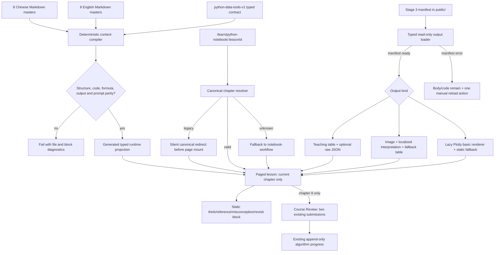

# Python Data Tools Stage 4：实施规划研究

**Researched:** 2026-07-15
**Domain:** Vue 3 静态课程内容投影、分页路由、manifest 资产消费、Plotly 交互与 Progress 兼容
**Confidence:** HIGH（仓库架构与资产）/ MEDIUM（外部库接入）

<user_constraints>
## User Constraints（来自实现上下文）

### Locked Decisions

#### 阅读结构与学习者语言

- **D-01:** 使用专用的八章分页课程页。桌面端保留常驻目录，移动端使用可展开目录；每章有稳定 URL、上一章/下一章导航，页面只渲染当前章节。
- **D-02:** 教学块按“问题 → 代码 → 运行结果 → 解读 → 限制或误区”就地编排，输出紧跟产生它的代码，不另建章末结果画廊。
- **D-03:** 学习者界面使用“运行结果”“图表解读”“分析发现”“需要注意”。`manifest`、`output`、`evidence` 仅作为内部实现术语，不出现在前端标题或说明中。
- **D-04:** 页面只显示“第 X / 8 章”和章节位置，不显示完成百分比、掌握度、通过状态或章节门槛。

#### 双语内容权威来源

- **D-05:** 现有八章中文 Markdown 母版继续作为中文唯一正文来源；新增八个一一对应的英文 Markdown 母版。运行时读取由母版生成或投影得到的 typed 内容，不在 Vue/TypeScript 中手写第二份正文。
- **D-06:** 英文采用自然教学表达，不做逐句直译；章节结构、公式、变量、代码、数值和输出绑定必须与中文完全一致。
- **D-07:** 切换语言时保留当前章节和位置，不跳回课程首页或第一章。
- **D-08:** Stage 3 中文标注 PNG 仍是唯一权威图片。英文模式复用同一图片，并提供英文标题、alt、坐标轴/图例翻译、完整解读和等价数据表；Plotly 的可见界面文案随语言切换。
- **D-09:** 正文只允许修改语言母版；生成的 runtime projection 不手工编辑，生成器提供 `--check` 模式检测漂移。

#### 权威输出呈现

- **D-10:** JSON 默认渲染为教学表格、关键值和解释；原始只读 JSON 仅放在可选展开区。
- **D-11:** Plotly 只保留小时范围、工作日/非工作日分组开关、悬停精确值、缩放、重置和当前筛选摘要，隐藏无关 modebar 工具。
- **D-12:** 资源失败只影响对应结果块：图片失败显示 alt、解释和等价数据表；Plotly 失败显示静态筛选说明与表格；单个 JSON 失败显示局部不可用信息；manifest 失败保留正文和代码，并只提供一次手动“重新加载运行结果”。不得出现整页错误或无限自动重试。
- **D-13:** Notebook 下载入口同时出现在课程页头与最终报告章底部，中文标签为“下载完整中文 Notebook”，并明确文件已经执行、包含输出、需要本地 Python 环境，同时链接环境依赖说明；不得暗示网页在线执行 Python。

#### 教学提示与课程回顾

- **D-14:** 不实现五套独立交互练习。五个 contract 学习停顿渲染为静态行内教学提示：“想一想”的具体问题后直接展示“参考思路”、相关误区与复看指引。
- **D-15:** 教学提示没有输入、提交、正确/错误、判分、重置、完成状态、门槛、存储或网络请求。
- **D-16:** 保留两个课程末 checkpoint 及现有提交和 Progress 机制，但前端区块命名为“课程回顾”，置于最终报告之后，不强调百分比或通过/失败。
- **D-17:** 两个新 checkpoint 使用新 ID，分别检查分组分析解读和“相关不代表因果”的限制；每题提交后显示参考解释和复看链接。旧 checkpoint attempt 原样保留，但旧问题不再作为当前题目展示。

#### 深链与兼容行为

- **D-18:** 旧章节 ID 使用集中、显式、静默映射：`notebook-rhythm → notebook-workflow`、`numpy-arrays → numpy-foundations`、`pandas-tables → pandas-structures`、`sklearn-small-model → pandas-analysis`、`reproducible-handoff → analysis-report`。
- **D-19:** 有效新章节 ID 直接打开原章节；未知 ID 才回退到第一章。旧深链跳转不显示迁移 banner，也不写 Progress。

### the agent's Discretion

- 专用页面、内容投影、输出加载器和教学展示组件的确切文件名及拆分粒度。
- CSS 在现有 module/shared layer 中的具体拆分方式，以及目录在断点处的细节样式。
- 母版到 typed runtime 的序列化格式和生成器内部实现，只要保持母版唯一编辑入口与 `--check` 漂移检测。
- Plotly 的具体 Vue 封装或渲染方式，只要不引入第二套数据、遵守受控交互范围并提供静态 fallback。
- 局部资源错误组件的视觉细节和一次性手动重载的内部状态实现。

### Deferred Ideas（OUT OF SCOPE）

- 英文 `.ipynb` 与英文专用 PNG。
- Pyodide、Jupyter server、后端 kernel、账号或后端验收系统。
- Stage 5 的完整浏览器矩阵、移动端视觉收口和网页—Notebook—数据端到端一致性审计。
- 更多交互练习、实战任务和练习进度体系。
- Progress V3、多设备同步或现有 Progress 信息架构重构。
</user_constraints>

## Project Constraints（来自 AGENTS.md）

- 使用 Vue 3、TypeScript、Vite、Pinia、Vue Router 以及既有样式层；不得引入新 UI 框架。页面组件只组合状态与展示，核心解析、路由归一化、数据变换和评分逻辑放入可测试的 data/utils 层。[VERIFIED: `AGENTS.md`]
- 新课程数据必须使用 typed schema；所有 `LocalizedCopy` 同时提供 `'zh-CN'` 与 `en`。公式、变量、代码、数值和交互中的名称必须一致。[VERIFIED: `AGENTS.md`]
- Markdown 与公式必须继续经过 `src/utils/markdownMath.ts`/`MarkdownMathContent.vue` 的 `markdown-it`、KaTeX、`sanitize-html` 安全路径；不得输出任意 raw HTML、脚本、内联事件或不受控 iframe。[VERIFIED: `AGENTS.md` + `src/utils/markdownMath.ts`]
- public 资产使用根绝对逻辑路径，再经过 `withPublicBase()` 兼容 GitHub Pages `BASE_URL`；不得引用本机绝对路径、临时路径或远程运行时图片。[VERIFIED: `AGENTS.md` + `src/utils/publicPath.ts`]
- 路由保持 lazy import；旧 URL 在具备显式 redirect 与测试前不得删除。现有三个 V1 Progress 数据源在 V2 迁移测试完成前不得删除。[VERIFIED: `AGENTS.md`]
- 颜色不得成为唯一信息来源；移动端、键盘、reduced-motion 与文字/静态 fallback 必须保留关键教学信息。[VERIFIED: `AGENTS.md`]
- 课程内容变化至少验证双语完整性、公式、资源存在和 checkpoint 可由正文推导；路由/结构变化更新结构测试，public path 变化覆盖 GitHub Pages base 场景。[VERIFIED: `AGENTS.md`]
- 每阶段独立验证、独立提交、独立 PR；不得触碰无关的 `public/data-lab/generated/*.png`，也不得读取、提交或修改 `docs/gpt_advice.md`。[VERIFIED: `AGENTS.md` + task boundary]
- 完成门槛包含 `npm test`、`npm run build`、`npm run build:pages`；Stage 5 才承担完整浏览器矩阵和最终视觉收口。[VERIFIED: `AGENTS.md` + Stage 4 spec]

## Summary

Stage 4 最安全的实现路径是建立一个“母版编译边界”：中文与英文 Markdown 只在构建/开发时由确定性脚本读取，脚本验证八章顺序、稳定 cell 标记、公式、代码和输出绑定的一一对应，再生成只读 typed runtime projection。Vue 页面只消费生成文件，不在组件或 `pythonNotebookModule.ts` 中复制正文。[VERIFIED: Stage 4 context D-05/D-06/D-09 + existing `build-notebook.py` parser pattern]

网页侧应拆为三个彼此可测试的边界：纯函数章节路由解析、manifest/输出加载与 schema 归一化、专用分页呈现。旧章节映射必须在 `AlgorithmView` 挂载及 `saveAlgorithmProgress()` 之前完成，否则当前 watcher 会先写 `lastVisitedModuleSlug`，直接违反“旧深链不写 Progress”。[VERIFIED: `src/views/AlgorithmView.vue` watcher order + D-18/D-19]

Plotly Figure JSON 使用 Plotly.py 6.9.0 生成，当前隔离环境报告其内嵌 Plotly.js 版本为 3.7.0；JSON 的 `x`/`y` 已使用 `bdata` 二进制编码。不要自制 Plotly JSON 解码器或用 D3 重新实现 Plotly 语义。建议按章节动态导入官方 `plotly.js-basic-dist-min@3.7.0`，它包含本课程需要的 `scatter`，并在卸载时 `purge()`。[VERIFIED: `.python-data-tools-venv` version probe + committed Plotly JSON] [CITED: https://github.com/plotly/plotly.js/] [CITED: https://plotly.com/javascript/plotlyjs-function-reference/]

**Primary recommendation:** 先完成双语母版与确定性 runtime projection，再实现纯 loader/route adapters，最后接入分页页面与现有 checkpoint/Progress；Plotly 作为第七章独立 lazy chunk，不扩大初始课程 bundle。[VERIFIED: repository lazy-route convention + locked stage boundary]

## Phase Requirements

| ID | Description | Research Support |
|---|---|---|
| R1 | 八章英文语义对齐 | 双语母版配对校验、稳定 cell/公式/代码同构、生成文件 `--check`。[VERIFIED: Stage 4 spec]
| R2 | 现有路由迁移为八章课程 | contract 顺序生成浅层 `StorySection` 与专用页面目录，页面只渲染当前章。[VERIFIED: contract + paged lesson pattern]
| R3 | 旧章节深链兼容 | 路由 guard 前置集中归一化，覆盖旧/新/未知 ID，重定向早于 Progress 写入。[VERIFIED: router + AlgorithmView]
| R4 | manifest 驱动运行结果与下载 | typed manifest loader、章节输出注册表、`withPublicBase()`、局部状态机与 Notebook 链接。[VERIFIED: Stage 3 manifest + public path helper]
| R5 | 五个静态教学提示 | 从母版 exercise marker 投影为只读 teaching-prompt block；模板不含 input/submit/state writer。[VERIFIED: Chinese masters + D-14/D-15]
| R6 | checkpoint 与 Progress 兼容 | 新 checkpoint ID 继续复用 append-only attempt writer，历史 fixture 验证旧记录不变。[VERIFIED: algorithm checkpoint/progress code]
| R7 | 内容与执行边界 | generator 与内容测试拒绝 sklearn、清洗实现、推断统计、因果结论、Pyodide/后端入口。[VERIFIED: contract statistics boundary + master tests]
| R8 | 双语无障碍与静态 fallback | 每个视觉/交互 adapter 同时要求 label、alt、文字解读和表格 fallback；Plotly 生命周期与键盘控件单测/结构测试。[VERIFIED: D-08/D-12 + AGENTS.md]

## Architectural Responsibility Map

| Capability | Primary Tier | Secondary Tier | Rationale |
|---|---|---|---|
| Markdown 母版到 typed projection | Build-time tooling | Static source | 浏览器不应读取 `docs/` 或解析编辑母版；生成器负责一致性与漂移检测。[VERIFIED: D-05/D-09]
| 八章正文与生成 projection | Static source | Browser / Client | Markdown 是编辑权威；生成 TS 只是可审计的运行时载体。[VERIFIED: D-05]
| 章节 ID 兼容与 canonical URL | Browser / Client router | — | 映射必须在页面状态和 Progress writer 之前执行。[VERIFIED: router/AlgorithmView]
| manifest、PNG、JSON、Notebook | CDN / Static (`public/`) | Browser loader | 文件由 Pages 静态发布，客户端只读获取并做 schema 检查。[VERIFIED: Stage 3 manifest]
| Plotly 受控交互 | Browser / Client | CDN / Static Figure JSON | 客户端渲染已提交 figure，不重新计算统计值。[VERIFIED: D-11 + Figure JSON]
| 静态教学提示 | Browser / Client presentation | Static source | 提示来自母版，只读展示，不产生进度、网络或存储状态。[VERIFIED: D-14/D-15]
| 课程末 checkpoint | Browser / Client | Browser localStorage | 继续使用已有提交和 append-only attempt 机制。[VERIFIED: D-16/D-17 + algorithmProgress]
| 数据清洗、代码执行、教师验收 | Out of scope | Future backend/Data Lab | Stage 4 明确不实现这些能力。[VERIFIED: Stage 4 spec]

## Standard Stack

### Core

| Library / Facility | Version | Purpose | Why Standard Here |
|---|---:|---|---|
| Vue | 3.5.30 | 专用分页页面与局部资源状态 | 已有框架与 `<script setup lang="ts">` 规范。[VERIFIED: `package.json`]
| TypeScript | 5.9.3 | runtime schema、loader union、route allowlist | 已有严格构建链；Node 24 可直接执行仓库 `.ts` 测试/导入。[VERIFIED: `package.json` + GitHub Actions]
| Vite | 8.0.11 | lazy chunk、Pages base、构建 | GitHub Pages workflow 使用 Node 24 与 Vite 构建。[VERIFIED: `package.json` + workflow]
| Vue Router | 5.0.4 | stable chapter URL、silent redirects、pager | 已有 generic learn route 和 route-param watcher。[VERIFIED: `package.json` + router]
| markdown-it + KaTeX + sanitize-html | 14.1.1 / 0.16.44 / 2.17.4 | 安全正文与公式 | `MarkdownMathContent` 已集中封装并对内部资源 rebasing。[VERIFIED: `package.json` + markdownMath]
| `withPublicBase()` | repository helper | manifest/PNG/JSON/Notebook URL | 已处理根绝对 public path 与 GitHub Pages base。[VERIFIED: `src/utils/publicPath.ts`]
| Node test runner | Node 24 | 纯 TS/结构/兼容测试 | `npm test` 运行 `node --test tests/*.test.*`。[VERIFIED: package/workflow]

### Supporting

| Library / Facility | Version | Purpose | When to Use |
|---|---:|---|---|
| `plotly.js-basic-dist-min` | 3.7.0 | 解释 Plotly.py 6.9 输出、scatter hover/zoom/reset | 仅在 `plotly-exploration` 章动态导入；不要在 `AlgorithmView` 顶层静态导入。[CITED: https://github.com/plotly/plotly.js/] [WARNING: package-legitimacy seam flags latest release as SUS only because it is too new; planner must add a human verification checkpoint before install.]
| `@types/plotly.js` | 3.0.10 | 为 basic bundle adapter 提供 Figure/Data/Layout/Config 类型 | 作为 dev dependency，并用一个最小 ambient module alias 将 basic bundle 指向这些类型。[VERIFIED: npm registry + package-legitimacy OK]
| Existing CSS tokens and module layers | repository | 分页布局、结果块、fallback、responsive | 新增独立 Python Data Tools module CSS；复用 linear paged lesson 布局思想，不复制整份样式。[VERIFIED: style inventory]

**Installation recommendation:**

```bash
npm install --save-exact plotly.js-basic-dist-min@3.7.0
npm install --save-dev --save-exact @types/plotly.js@3.0.10
```

`plotly.js-basic-dist-min@3.7.0` 的 unpacked size 约 1.12 MB、无 postinstall，来源仓库指向 `plotly/plotly.js`；`@types/plotly.js@3.0.10` 约 131 KB、无 postinstall。[VERIFIED: npm registry probes] 该包必须通过动态 import 成为章节级 chunk，不能让整个 Algorithm 路由首屏同步加载 Plotly。[VERIFIED: project lazy-load constraint]

不需要新增 UI 框架、状态库、Markdown parser、schema 库或网络 client；现有 Vue、原生 `fetch`、typed guards 和安全 Markdown 路径足够。Plotly basic bundle 与其类型是本阶段唯一建议新增的依赖。[VERIFIED: codebase dependency and Figure JSON audit]

## Package Legitimacy Audit

| Package | Registry | Age / Signal | Downloads | Source Repo | Verdict | Disposition |
|---|---|---|---:|---|---|---|
| `plotly.js-basic-dist-min@3.7.0` | npm | 发布于 2026-07-03；无 postinstall | 34,369/week（package signal） | `github.com/plotly/plotly.js` | SUS（too-new） | 保留；planner 在安装前加入 `checkpoint:human-verify`。[VERIFIED: package-legitimacy seam + npm registry] |
| `@types/plotly.js@3.0.10` | npm | 成熟 DefinitelyTyped package；无 postinstall | 817,096/week（package signal） | `github.com/DefinitelyTyped/DefinitelyTyped` | OK | Approved。[VERIFIED: package-legitimacy seam + npm registry] |

**Packages removed due to SLOP verdict:** none.
**Packages flagged as suspicious [SUS]:** `plotly.js-basic-dist-min@3.7.0`（仅因最新版本发布时间短；官方 Plotly 仓库与当前 Plotly.py 内嵌 JS 版本均指向 3.7.0，但协议仍要求安装前人工确认）。[VERIFIED: official repo + local environment + legitimacy seam]

## Architecture Patterns

### System Architecture Diagram



上述数据流确保内容编译、资源获取、路由兼容和进度写入彼此隔离；任何资源失败都不会阻断正文或触发 Progress。[VERIFIED: locked decisions + current architecture]

### Recommended Project Structure

```text
docs/curriculum-v3/python-data-tools/
├── chinese-master/                 # existing editable authority
└── english-master/                 # new one-to-one editable authority

scripts/python-data-tools/
└── build-runtime-content.mjs       # deterministic generate / --check

src/
├── data/
│   ├── pythonNotebookContract.ts   # chapter/output/prompt policy authority
│   ├── pythonNotebookModule.ts     # shallow module registration from projection
│   └── generated/
│       └── pythonDataToolsRuntime.generated.ts
├── types/
│   └── pythonDataToolsRuntime.ts   # runtime blocks, manifest, resource states
├── utils/
│   ├── pythonDataToolsRoutes.ts    # pure legacy/new/unknown resolution
│   └── pythonDataToolsOutputs.ts   # pure guards, fetch adapters, table view models
├── components/
│   ├── PythonDataToolsPagedLesson.vue
│   ├── PythonDataToolsResultBlock.vue
│   ├── PythonDataToolsPlotlyFigure.vue
│   └── PythonDataToolsTeachingPrompt.vue
└── styles/modules/python-data-tools.css
```

这些文件名属于推荐拆分，不是新的锁定需求；planner 可以在保持责任边界的前提下调整。[VERIFIED: context discretion]

### Pattern 1: Paired-master deterministic projection

**What:** 生成器从 contract 获取八章顺序，逐章读取中英 Markdown，按既有 `<!-- cell: ... -->` 与 `<!-- exercise: ... -->` 标记拆成 typed blocks。它必须比较中英 block kind、cell ID、role、output ID、公式序列和 Python code bytes；只有可见 prose 允许不同。[VERIFIED: existing marker grammar + D-05/D-06]

**When:** 每次修改任一语言母版时先运行 generate，再运行 `--check`；CI 的 content test 调用 `--check`，拒绝手工修改生成文件。[VERIFIED: D-09]

```js
// Source: existing scripts/python-data-tools/build-notebook.py pattern, adapted to paired masters.
const chapters = pythonDataToolsContract.chapters.map(({ id }, index) =>
  compileChapterPair(zhPath(index, id), enPath(index, id), id)
)
assertExactCrossLocaleStructure(chapters)
writeOrCheckGeneratedModule(serializeDeterministically(chapters), process.argv.includes('--check'))
```

生成输出应使用固定 key 顺序、LF、UTF-8 和末尾换行；错误必须指出 language、file、chapter、cell/prompt 和第一处不一致。[VERIFIED: Stage 3 deterministic generator precedent]

### Pattern 2: Route normalization before component state

**What:** 把 5 个旧 ID、8 个新 ID 和 unknown fallback 放在一个纯函数/readonly map 中，由 `/learn/python-notebook/:lessonId` 的专用 guard 调用。根 `/learn/python-notebook` 仍可访问并 canonicalize 到第一章；专用 route 必须排在 generic `/learn/:moduleId/:lessonId` 之前。[VERIFIED: current route order + D-18/D-19]

**Why:** 当前 `AlgorithmView` watcher 在发现未知章节前已经调用 `saveAlgorithmProgress(setLastVisited...)`；因此在页面内补 mapping 会留下旧深链写入副作用。[VERIFIED: `AlgorithmView.vue`]

```ts
export const legacyPythonDataToolsChapterMap = {
  'notebook-rhythm': 'notebook-workflow',
  'numpy-arrays': 'numpy-foundations',
  'pandas-tables': 'pandas-structures',
  'sklearn-small-model': 'pandas-analysis',
  'reproducible-handoff': 'analysis-report',
} as const

export function resolvePythonDataToolsChapter(id: string) {
  if (id in legacyPythonDataToolsChapterMap) return { kind: 'legacy', id: legacyPythonDataToolsChapterMap[id] }
  if (chapterIdSet.has(id)) return { kind: 'current', id }
  return { kind: 'unknown', id: 'notebook-workflow' }
}
```

### Pattern 3: Typed, local-failure output loader

**What:** loader 首先读取唯一 manifest URL，再以 output ID 查找 public path；每个 JSON 独立 fetch、检查 `response.ok`、parse 和 type guard。UI 接收 discriminated union：`idle | loading | ready | error`，而不是异常或一组 loosely typed refs。[VERIFIED: manifest schema + D-12]

```ts
type LoadState<T> =
  | { status: 'idle' | 'loading' }
  | { status: 'ready'; value: T }
  | { status: 'error'; message: LocalizedCopy }

async function fetchJson<T>(path: string, guard: (value: unknown) => value is T): Promise<T> {
  const response = await fetch(withPublicBase(path))
  if (!response.ok) throw new Error(`HTTP ${response.status}`)
  const value: unknown = await response.json()
  if (!guard(value)) throw new Error('Unexpected authoritative output schema')
  return value
}
```

manifest fetch 只在页面会话首次需要时自动执行；失败后不自动循环，显式按钮调用一次 reload transition。图片错误通过 `@error` 进入本地 fallback，不让浏览器保留损坏图标。[VERIFIED: D-12]

### Pattern 4: Output adapters, not generic JSON dumping

**What:** 为 4 个 JSON 各建立纯函数 view-model adapter，输出表头、行、key metrics、解释与 raw disclosure。不要在 Vue template 中遍历任意对象，也不要让组件直接理解 Stage 3 snake_case/camelCase 混合 schema。[VERIFIED: committed JSON schema inventory]

**Important seam:** PNG 的“等价数据表”所需精确值不全存在于 PNG manifest；它们分布于 `workingday-comparison.json` 和 `final-analysis-evidence.json`。规划时应建立一个显式、typed、只读的 `fallbackSourceIds` 依赖表，从现有权威 JSON 提取表格，且测试把“主结果卡消费”与“fallback 数据依赖”分开计数。不得手抄数值、从 PNG OCR、浏览器重算统计或新增第二份 JSON。[VERIFIED: Stage 3 output audit + D-08/D-12]

推荐 fallback 依赖：逐小时图使用 `workingday-comparison` 的既有 48 行；用户构成、季节与天气表使用 `final-analysis-evidence` 的既有分组/构成字段。主结果卡仍只在 contract 所属章节出现，fallback dependency 仅在对应图片失败时呈现。[VERIFIED: committed JSON content] 这是满足“等价数据表”和“不得维护第二套精确数值”的唯一现有资产路径；测试必须明确这一语义，避免把 fallback 误判为第二张主结果卡。[VERIFIED: Stage 4 constraints]

### Pattern 5: Plotly as an isolated lifecycle component

**What:** 仅第七章成功加载 Figure JSON 后动态 import `plotly.js-basic-dist-min`。首次/后续更新使用 `Plotly.react()`；过滤生成新的 trace arrays 或递增 `layout.datarevision`；卸载时 `Plotly.purge()`。[CITED: https://plotly.com/javascript/plotlyjs-function-reference/]

配置固定为 `responsive: true`、`displaylogo: false`，modebar 只保留 zoom/reset 相关能力；工作日开关与小时范围放在站点自己的具名、键盘可用控件中，当前筛选摘要用普通文本持续可见。[CITED: https://plotly.com/javascript/configuration-options/] [VERIFIED: D-11]

不要修改原始 Figure 对象；每次从 loader 的 immutable source 派生 localized layout/trace 副本。语言切换只重建文案和图例，不修改 route/chapter，也不复位用户当前筛选。[VERIFIED: D-07/D-08]

### Pattern 6: Static prompt and compatible course review

**What:** `exercise` marker 只作为稳定内容锚点，runtime type 命名为 `TeachingPromptBlock`，包含 `id/kind/question/referenceReasoning/misconception/revisit` 的双语文案。模板仅输出语义 section/article、文本和 revisit link；没有 form、input、button、emit、ref 状态或 storage/network import。[VERIFIED: D-14/D-15]

课程回顾继续复用 `AlgorithmCheckpointQuiz` 的答案评估与 `onAlgorithmQuizSubmit()` writer，但增加 Python 专用 presentation variant：标题改为“课程回顾”，隐藏完成/得分强调，revisit 使用章节深链，且仅在 `analysis-report` 章末渲染。[VERIFIED: current checkpoint component + D-16/D-17]

### Anti-Patterns to Avoid

- **在 `pythonNotebookModule.ts` 手写 8 章正文：** 会形成第三份正文并绕过 `--check`。[VERIFIED: D-05/D-09]
- **在 `AlgorithmView` watcher 内才映射旧 ID：** watcher 已先写 Progress，违反无副作用 redirect。[VERIFIED: current code]
- **用 D3/Canvas 自制 Plotly Figure decoder：** 当前 Figure 使用 `bdata`/`dtype`，自制 decoder 和 hover/zoom 会复制 Plotly 的协议与生命周期复杂度。[VERIFIED: Figure JSON]
- **静态 import 完整 Plotly bundle：** 会把不相关课程的 Algorithm chunk 一并放大；使用 basic bundle + dynamic import。[VERIFIED: route/component import structure]
- **在模板里显示 raw JSON 作为默认结果：** 不符合教学视图，且难以做双语字段解释与 fallback。[VERIFIED: D-10]
- **资源错误升级为整页 error：** 正文、代码、提示和课程回顾必须独立可用。[VERIFIED: D-12]
- **把 teaching prompt 接进 checkpoint/Progress：** 它们必须是完全静态的教学停顿。[VERIFIED: D-14/D-15]
- **复用旧 checkpoint ID 放入新问题：** 历史 attempt 的语义会被悄悄改写；必须使用新 ID。[VERIFIED: D-17]

## Don't Hand-Roll

| Problem | Don't Build | Use Instead | Why |
|---|---|---|---|
| Markdown/公式/XSS | 新 renderer 或 raw `v-html` | `MarkdownMathContent` / `renderMarkdownWithMath` | 已有 sanitizer、KaTeX 与 public-path transform。[VERIFIED: codebase] |
| GitHub Pages URL | 字符串拼接 repo name | `withPublicBase()` | 已覆盖 `/`、已有 base、external/special path。[VERIFIED: helper tests/code] |
| Plotly JSON | `bdata` decoder、D3 仿 Plotly | 官方 basic dist 3.7.0 | Figure 与 Plotly.py 内嵌 JS 版本一致，原生处理 hover/zoom/reset。[VERIFIED: environment/Figure] |
| 权威统计 | 浏览器从 CSV 重算、Vue 常量 | Stage 3 JSON/PNG/Figure + typed adapters | 避免口径和精度漂移。[VERIFIED: Stage 3 design] |
| Progress migration | 新 localStorage key/writer | `appendAlgorithmQuizAttempt` + existing V1/V2 migration | 旧 attempt 必须原样保留。[VERIFIED: progress code/spec] |
| 双语同步 | Vue 内双份 prose | paired Markdown compiler | 结构、代码、公式和 output binding 可机器校验。[VERIFIED: D-05/D-06] |
| 路由兼容 | 多组件 scattered if/else | centralized resolver + guard | 可覆盖 5+8+unknown，且早于页面副作用。[VERIFIED: route architecture] |
| JSON schema library | 本阶段新引入大型 validator | 小而明确的 typed guards | 只有 1 个 manifest 与 5 类固定 payload，且仓库没有通用 schema dependency。[VERIFIED: asset/package inventory] |

**Key insight:** 本阶段复杂度主要来自“保持一个权威来源并让失败局部化”，不是来自新算法；复用现有 sanitizer、Progress 和 Pages helper，比新增平行系统更重要。[VERIFIED: Stage 4 scope]

## Runtime State Inventory

| Category | Items Found | Action Required |
|---|---|---|
| Stored data | `ml-atlas:algorithm-progress:v1` 保存 module attempts；V2 `ml-atlas:learning-progress:v2` 与 migration marker 读取 V1；另有 math/data V1 keys。[VERIFIED: source/STATE/config] | 代码编辑只新增 checkpoint ID；不得删除、rename 或 rewrite keys。使用含两个旧 Python checkpoint attempts 的 fixture 验证 load + new submit 后历史数组仍完整。 |
| Live service config | GitHub Pages workflow 在 build step 注入 `VITE_BASE_PATH=/ML_tutorial_Site/`；未发现本阶段相关的外部 UI/数据库配置。[VERIFIED: `.github/workflows/deploy-pages.yml` + repo search] | 不迁移服务状态；build/pages 测试验证 loader 与下载路径。 |
| OS-registered state | `launchctl`/PM2 probe 未发现 `ML Atlas`、`python-notebook` 或 `python-data-tools` 注册项。[VERIFIED: local read-only probe] | None。 |
| Secrets/env vars | 当前环境变量名称 probe 未发现阶段相关 secret；唯一相关 build input 是 workflow 中的非秘密 `VITE_BASE_PATH`。[VERIFIED: env-name probe + workflow] | None；不要新增 API key、CDN 或后端 endpoint。 |
| Build artifacts / installed packages | ignored `dist/` 含 Stage 3 public assets；`.python-data-tools-venv/` 被忽略且内含 Plotly.py 6.9.0 / Plotly.js 3.7.0。[VERIFIED: filesystem + git-ignore + version probe] | 正式验证重新运行 build/build:pages；不要提交 dist/venv。安装新 npm dependency 时更新 package-lock。 |

## Common Pitfalls

### Pitfall 1: Cross-locale prose looks complete but code structure drifts

**What goes wrong:** 英文章节少一段、移动一个 code block、改变变量名或 output marker，页面仍能构建却不再与 Notebook 对齐。[VERIFIED: paired-authority requirement]
**How to avoid:** generator 比较完整 block signature 与 code bytes，并对公式 token 序列做等值检查；`--check` 纳入测试。[VERIFIED: D-06/D-09]
**Warning signs:** 章节 block 数、cell marker 数或 output binding 不同；英文出现 placeholder/TODO。[VERIFIED: Stage 4 acceptance]

### Pitfall 2: Redirect occurs after Progress write

**What goes wrong:** 旧深链先挂载 AlgorithmView，`setLastVisitedAlgorithmModule()` 写 storage，再 replace 新 URL。[VERIFIED: current watcher]
**How to avoid:** dedicated router guard 先 canonicalize，route tests 使用 storage spy 断言 0 writes。[VERIFIED: D-18/D-19]

### Pitfall 3: Fallback tables become a second statistics source

**What goes wrong:** 为 PNG 手抄一组均值/计数，后续 Stage 3 重生成后页面静态表漂移。[VERIFIED: current asset separation]
**How to avoid:** fallback adapter 只读取 committed canonical JSON；明确 `primaryPlacement` 与 `fallbackSourceIds`，不从 CSV 重算。[VERIFIED: D-08/D-12 + output audit]

### Pitfall 4: Plotly state mutates the authoritative Figure JSON

**What goes wrong:** filter/locale 更新直接 splice trace 或覆盖 layout，重置后无法回到 manifest 默认状态，语言切换还会重置章节/筛选。[VERIFIED: mutable Figure risk]
**How to avoid:** 保留 immutable source，派生新 arrays/layout，reset 从 `defaultFilterState` 重建，unmount `purge()`。[CITED: https://plotly.com/javascript/plotlyjs-function-reference/]

### Pitfall 5: Bundle and lifecycle leak

**What goes wrong:** 顶层 import Plotly 使所有算法课承担图表 bundle；反复 `newPlot()` 或未 `purge()` 留下 resize/event handlers。[CITED: Plotly function reference]
**How to avoid:** chapter-local dynamic import、`react()`、`purge()`；构建后检查 chunk，结构测试确认 dynamic import。[VERIFIED: project lazy-load rule]

### Pitfall 6: Generic checkpoint UI contradicts course language

**What goes wrong:** 页面出现“模块 checkpoint”“答对 2/2”“算法已完成”，与“课程回顾”和不强调验收的决策冲突。[VERIFIED: current component + D-04/D-16]
**How to avoid:** presentation variant 只改可见语气，不改 submit/evaluate/append 机制；仅最终章渲染。[VERIFIED: locked decision]

### Pitfall 7: User-facing internal words leak

**What goes wrong:** loader/adapter 名字被直接用作面板标题，出现 manifest/output/evidence/“证据”。[VERIFIED: D-03]
**How to avoid:** 内部 types 保留技术名；可见 copy 统一由 typed localized labels 输出“运行结果/图表解读/分析发现/需要注意”。[VERIFIED: D-03]

### Pitfall 8: Manifest failure retries forever or blocks the chapter

**What goes wrong:** watchEffect 或 retry timer 持续 fetch；页面显示 spinner 而正文不渲染。[VERIFIED: common state-loop risk + D-12]
**How to avoid:** one-shot automatic load + explicit manual transition；正文 projection 不依赖 manifest promise。[VERIFIED: D-12]

### Pitfall 9: Root-absolute assets fail only on GitHub Pages

**What goes wrong:** `/notebooks/...` 在 localhost 正常，在 `/ML_tutorial_Site/` 下 404。[CITED: https://vite.dev/guide/build]
**How to avoid:** 所有动态 manifest/asset/download URL 经过 `withPublicBase()`；测试同时使用 `/` 与 `/ML_tutorial_Site/`。[VERIFIED: project helper]

## Code Examples

### Constrained Plotly lifecycle

```ts
// Source: https://plotly.com/javascript/plotlyjs-function-reference/
const Plotly = (await import('plotly.js-basic-dist-min')).default
await Plotly.react(graphDiv, localizedFilteredData, localizedLayout, {
  responsive: true,
  displaylogo: false,
  modeBarButtonsToRemove: ['toImage', 'pan2d', 'select2d', 'lasso2d', 'autoScale2d'],
})

onBeforeUnmount(() => {
  if (graphDiv) Plotly.purge(graphDiv)
})
```

具体保留/移除按钮列表应由 component test 锁定为 D-11 的最小交互集合；站点自己的 Reset 按钮恢复 `defaultFilterState`，不依赖 modebar 文案。[VERIFIED: D-11]

### Immutable locale/filter projection

```ts
const renderedTraces = computed(() =>
  authoritativeFigure.value.data
    .filter((trace) => selectedGroups.value.has(groupCode(trace)))
    .map((trace) => ({
      ...trace,
      name: groupLabel(groupCode(trace), locale.value),
      x: filteredX(trace, hourRange.value),
      y: filteredY(trace, hourRange.value),
      customdata: filteredCustomData(trace, hourRange.value, locale.value),
    })),
)
```

这段逻辑只筛选和本地化已提交 Figure 的点，不计算新的均值、中位数或样本数。[VERIFIED: D-11 + Figure schema]

## State of the Art

| Old Approach | Current Stage 4 Approach | Impact |
|---|---|---|
| 5 章 `StoryScroller` + `AppliedWorkflowLessonLab` 通用卡片 | 8 章专用分页页，只渲染当前章 | URL、阅读位置和输出归属可审计。[VERIFIED: current runtime/spec] |
| Vue/TS 手写中英正文 | paired Markdown → generated typed projection | 母版成为唯一编辑入口，漂移可由 `--check` 阻断。[VERIFIED: D-05/D-09] |
| 页面没有 Stage 3 输出 | manifest → typed adapters → local result blocks | 精确值、图片、Figure 与 Notebook 来自同一执行链。[VERIFIED: Stage 3 manifest] |
| 旧 sklearn checkpoint IDs/问题 | 新 grouped-analysis + correlation-limit IDs | 历史 attempt 语义不被重写。[VERIFIED: D-17] |
| 通用“模块 checkpoint/完成率”语气 | 最终章“课程回顾” presentation | 保留提交兼容而不强调验收状态。[VERIFIED: D-16] |

**Deprecated/outdated within this module:** `sklearn-small-model` 正文、旧 5 章 current navigation、旧两题作为当前题目、`AppliedWorkflowLessonLab` 的 Python 通用卡片。[VERIFIED: Stage 4 spec] 这些内容可停止注册，但旧 URL/attempt 必须继续兼容，不能物理删除兼容映射或数据。[VERIFIED: R3/R6]

## Validation Architecture

### Test Framework

| Property | Value |
|---|---|
| Framework | Node 24 built-in test runner + `assert/strict`。[VERIFIED: package/workflow] |
| Config file | none；glob 由 `package.json` script 定义。[VERIFIED: package] |
| Quick run command | `node --test tests/python-data-tools-runtime-*.test.ts` |
| Full suite command | `npm test` |
| Build gates | `npm run build` and `npm run build:pages` |

### Phase Requirements → Test Map

| Req ID | Behavior | Test Type | Automated Command | File Exists? |
|---|---|---|---|---|
| R1 | 8+8 masters、block/code/formula/output parity、generated drift | content/compiler | `node --test tests/python-data-tools-runtime-content.test.ts` | ❌ Wave 0 |
| R2 | module has exactly contract 8 chapters; page current-only/toc/pager/no percent | registration/structure | `node --test tests/python-data-tools-runtime-page.test.ts` | ❌ Wave 0 |
| R3 | 5 legacy + 8 current + unknown/root resolution; no storage write | unit/router structure | `node --test tests/python-data-tools-runtime-routing.test.ts` | ❌ Wave 0 |
| R4 | manifest guards、8 primary placements、base paths、download、local errors | unit/structure | `node --test tests/python-data-tools-runtime-outputs.test.ts` | ❌ Wave 0 |
| R5 | 5 prompt blocks complete, no form/events/network/storage | content/negative structure | `node --test tests/python-data-tools-runtime-prompts.test.ts` | ❌ Wave 0 |
| R6 | new IDs/revisit; old attempt fixture preserved after new submit | unit/migration | `node --test tests/python-data-tools-runtime-progress.test.ts` | ❌ Wave 0 |
| R7 | no sklearn/cleaning/inference/causal/Pyodide/backend/upload | content/negative | extend `tests/python-data-tools-runtime-content.test.ts` | ❌ Wave 0 |
| R8 | bilingual label/alt/fallback; Plotly dynamic import/purge/controls | structure/unit | extend page/output tests | ❌ Wave 0 |

### Concrete test seams

- compiler tests should execute `node scripts/python-data-tools/build-runtime-content.mjs --check`, copy fixture pairs to a temp directory, and inject missing English block, changed code byte, duplicate marker and stale generated output.[VERIFIED: existing temp-fixture patterns in tests]
- route resolver tests are pure and must not import Vue; router source test verifies dedicated Python route appears before generic lesson route.[VERIFIED: current routing test style]
- loader tests inject a fake `fetch`, cover HTTP error, invalid JSON, duplicate/unknown output, wrong contract version, single-output error and manual manifest reload; assert no storage/global progress imports.[VERIFIED: current Node test capability]
- view-model adapter tests read committed JSON directly and assert table rows derive from payload rather than constants in Vue files.[VERIFIED: Stage 3 assets]
- component structure tests follow repository precedent (read SFC source) because Vue Test Utils/jsdom are not installed; Stage 5 retains full browser behavior verification.[VERIFIED: package/tests inventory + Stage 5 boundary]
- progress compatibility test uses in-memory `StorageLike`, starts with old checkpoint attempts, appends two new IDs, reloads and deep-compares the old prefix.[VERIFIED: existing algorithm progress tests]

### Sampling Rate

- **Per task commit:** related single test file plus compiler `--check` when masters/projection change.
- **Per wave merge:** all `python-data-tools-*` tests, then `npm test`.
- **Phase gate:** `npm test`, `npm run build`, `npm run build:pages`, `git diff --check`; no full Stage 5 browser matrix.

### Wave 0 Gaps

- [ ] `tests/python-data-tools-runtime-content.test.ts`
- [ ] `tests/python-data-tools-runtime-routing.test.ts`
- [ ] `tests/python-data-tools-runtime-outputs.test.ts`
- [ ] `tests/python-data-tools-runtime-prompts.test.ts`
- [ ] `tests/python-data-tools-runtime-page.test.ts`
- [ ] `tests/python-data-tools-runtime-progress.test.ts`

不需要新增测试框架或配置。[VERIFIED: Node 24 runner]

## Recommended Plan Decomposition

### Wave 1 — Content authority and compiler

1. 把中文五个“形成性反馈”区校准为静态“想一想 → 参考思路 → 常见误区 → 复看”母版内容，不改变 cell/output marker 或 Notebook code。[VERIFIED: D-14/D-15]
2. 新增八个英文 Markdown 母版，保持同一文件顺序、cell marker、code bytes、公式与 output binding。[VERIFIED: D-05/D-06]
3. 增加 runtime types、paired compiler、generated projection、`--check` 与 R1/R5/R7 测试。[VERIFIED: D-09]
4. 本 wave 不切换 `pythonNotebookModule`、路由或 checkpoint；生成 projection 先作为未接线产物通过测试，使现有五章运行时在集成 wave 前保持完整。[VERIFIED: gradual migration rule]

### Wave 2 — Authoritative outputs and render adapters

1. 在人工确认 package 后安装 Plotly basic + types；加 ambient module alias、dynamic import boundary。[VERIFIED: package audit]
2. 实现 manifest guards、output load states、per-output JSON adapters、Notebook/environment links和 PNG error handling。[VERIFIED: R4/R8]
3. 实现 Plotly component、locked controls、immutable filter/localization、`react/purge` 与 static fallback。[VERIFIED: D-11/D-12]
4. 完成 outputs tests，并运行 build/build:pages 观察 chunk 与 base path。[VERIFIED: project acceptance]

### Wave 3 — Atomic runtime integration

1. 增加 dedicated Python route + pure resolver，在 generic route 和 AlgorithmView side effects 前 canonicalize。[VERIFIED: routing audit]
2. 增加 paged lesson、desktop/mobile toc、current-only blocks、header/final download、pager 和 chapter location；Python 页不显示通用 progress/complete hero status。[VERIFIED: D-01/D-04/D-13]
3. 在同一个 integration task 中让 `pythonNotebookModule.chapters` 从 projection 派生，接入 generated blocks、result adapters 与 teaching prompts，并同步切换两个新 checkpoint ID/revisit；不得留下“8 章新正文 + 旧题目/旧 revisit”的中间状态。[VERIFIED: D-02/D-17 + gradual migration rule]
4. 完成 page/routing/prompts/checkpoint tests；确保 user-facing copy 不出现“证据”或内部术语。[VERIFIED: D-03 + validation map]

### Wave 4 — Compatibility closeout

1. 为现有 checkpoint component 完成 course-review presentation 细节，仅最终章渲染，保留 evaluate/submit/append writer。[VERIFIED: D-16]
2. 加旧 attempt fixture；更新所有旧 5 章静态测试期望到 8 章，并保留 legacy map assertions。[VERIFIED: test inventory]
3. 审查 PNG/Plotly/JSON/manifest 的每个局部失败路径、键盘标签、reduced-motion 静态信息和 Pages base 路径。[VERIFIED: R4/R8]
4. 运行全部测试、两种 build、安全负向断言、diff 范围审计；本阶段单独提交，不包含用户文件。[VERIFIED: AGENTS Definition of Done]

## Security Domain

`.planning/config.json` 未显式关闭 `security_enforcement`，因此本研究包含安全域。[VERIFIED: config]

### Applicable ASVS Categories

| ASVS Category | Applies | Standard Control |
|---|---|---|
| V2 Authentication | no | 静态公开课程，无账号/认证入口。[VERIFIED: stage scope] |
| V3 Session Management | no | 无服务端 session；locale/Progress 属本地偏好与学习记录，不是认证 session。[VERIFIED: codebase] |
| V4 Access Control | no | 所有课程与 public 资产公开；无受保护资源。[VERIFIED: router/public assets] |
| V5 Validation, Sanitization and Encoding | yes | route param allowlist、manifest/output typed guards、数字 filter clamp/finite checks、`sanitize-html` Markdown path。[VERIFIED: planned seams + existing sanitizer] |
| V6 Cryptography | no new crypto | Stage 3 hashes由 CI/静态测试验证；浏览器不手制加密或签名。[VERIFIED: Stage 3 tests/design] |
| V12 Files and Resources | limited | 只下载固定 manifest Notebook；无 upload、任意路径或用户文件名。[VERIFIED: D-13 + scope] |
| V14 Configuration | yes | `withPublicBase()`、explicit Plotly config、无 CDN/remote template、build/pages gates。[VERIFIED: helper/Figure/spec] |

### Known Threat Patterns for This Stack

| Pattern | STRIDE | Standard Mitigation |
|---|---|---|
| 恶意/损坏 Markdown raw HTML | Tampering / XSS | 只经 `MarkdownMathContent` + sanitizer；generated projection 不直接 `v-html`。[VERIFIED: codebase] |
| 损坏或结构漂移的 manifest/JSON | Tampering / DoS | `response.ok` + unknown parse + typed guard + local error state；不执行 payload 内容。[VERIFIED: planned loader boundary] |
| route param 路径/ID 注入 | Tampering | 只接受 contract ID set 和 5 个 legacy keys；unknown 固定回第一章。[VERIFIED: D-18/D-19] |
| Plotly payload 中远程 template/任意 HTML | Information disclosure / XSS | Stage 3 测试已拒绝 remote URL；renderer仅加载 committed trusted figure，隐藏导出/cloud tools，fallback 永远可读。[VERIFIED: Stage 3 test + Plotly security note] |
| 无限 retry/resource storm | DoS | 一次自动 fetch、显式 manual reload、AbortController on unmount、无 timer retry。[VERIFIED: D-12] |
| localStorage 历史破坏 | Tampering | append-only helper、fixture deep comparison、无新 writer/key。[VERIFIED: algorithmProgress]

Plotly 官方安全说明假定图表数据通常由应用控制；本项目只渲染提交在仓库并经 Stage 3 hash/schema 测试的 Figure，不接受用户或网络第三方 Figure。[CITED: https://github.com/plotly/plotly.js/security] [VERIFIED: Stage 3 pipeline]

## Environment Availability

| Dependency | Required By | Available | Version | Fallback |
|---|---|---|---|---|
| Node.js | compiler/tests/build | ✓ | 24.16.0 locally; CI pins 24 | — [VERIFIED: probe/workflow] |
| npm | dependency/build | ✓ | 11.13.0 | — [VERIFIED: probe] |
| Python Data Tools venv | asset compatibility inspection only | ✓ | Python stack includes Plotly.py 6.9.0 / JS 3.7.0 | Stage 4 不重生成资产。[VERIFIED: probe/spec] |
| `plotly.js-basic-dist-min` | browser interactive renderer | ✗ not installed | recommended 3.7.0 | 静态 Plotly fallback remains if dynamic import fails; install still required for D-11 interactive acceptance。[VERIFIED: package inventory] |
| External backend/service | none | n/a | — | 本阶段禁止。[VERIFIED: scope] |

**Missing dependencies with no functional replacement:** `plotly.js-basic-dist-min@3.7.0` for authoritative Figure JSON interaction; planner must schedule the legitimacy checkpoint and install.[VERIFIED: Figure `bdata` + no current Plotly JS dependency]
**Missing dependencies with fallback:** interactive Plotly can fail locally at runtime and show its locked static table/description, but that fallback does not remove the implementation requirement.[VERIFIED: D-12]

## Assumptions Log

| # | Claim | Section | Risk if Wrong |
|---|---|---|---|
| — | None. Recommendations are derived from locked context, repository inspection, local version probes, official Vite/Vue Router/Plotly docs, and package seams. | — | — |

## Open Questions (RESOLVED)

1. **Package legitimacy checkpoint outcome — resolved disposition**
   - What we know: official Plotly repository publishes the recommended basic bundle, and exact 3.7.0 matches the JS runtime bundled by the locked Plotly.py 6.9.0 environment.[VERIFIED: official repo + local probe]
   - Approval status: this research does **not** pre-approve the package; the automated legitimacy seam labels the newest release SUS solely due to age.[VERIFIED: seam]
   - Resolved gate: Plan 06 must rerun the read-only package-legitimacy audit and obtain explicit human approval. Plan 07 remains blocked until that approval is recorded.[VERIFIED: package protocol]
   - Rejection path: if approval is rejected, return to replanning or separately verify an official compatible version or a Stage 3 asset revision before continuing; do not install or silently substitute the dependency.[VERIFIED: package protocol + asset schema]

No additional product decision is required; PNG fallback ownership is resolved through explicit typed fallback dependencies on existing authoritative JSON, not by adding or hand-copying data.[VERIFIED: asset audit]

## Sources

### Primary / Repository (HIGH confidence)

- `AGENTS.md`, Stage 4 spec/context, Stage 2/3 designs — scope, locked UX/content/compatibility decisions.
- `src/data/pythonNotebookContract.ts`, `pythonNotebookModule.ts`, `algorithmCheckpoints.ts` — typed contracts and old runtime.
- `src/views/AlgorithmView.vue`, `src/router/index.ts`, `src/curriculum/routes.ts` — current route/state side effects.
- `src/utils/publicPath.ts`, `markdownMath.ts`, `algorithmProgress.ts` — base paths, sanitization and append-only progress.
- `public/notebooks/python-data-tools/outputs/*` and executed Notebook — actual schemas, paths, Figure encoding and fallback-value availability.
- `package.json`, GitHub Pages workflow, local runtime probes — exact stack and environment.

### Official external (MEDIUM confidence via official pages)

- [Vite Static Asset Handling](https://vite.dev/guide/assets.html) — public assets use root-absolute paths.
- [Vite Public Base Path](https://vite.dev/guide/build) — dynamic URLs use `import.meta.env.BASE_URL` under nested deployment.
- [Vue Router Programmatic Navigation](https://router.vuejs.org/guide/essentials/navigation) — `push`/`replace` semantics.
- [Vue Router Route Matching](https://router.vuejs.org/guide/essentials/route-matching-syntax.html) — route params and matching.
- [Plotly.js official repository](https://github.com/plotly/plotly.js/) — official npm bundles and basic/partial bundles.
- [Plotly Configuration Options](https://plotly.com/javascript/configuration-options/) — responsive, logo and modebar controls.
- [Plotly Function Reference](https://plotly.com/javascript/plotlyjs-function-reference/) — `newPlot`, `react`, `relayout`, `purge`.
- [Plotly Security Policy](https://github.com/plotly/plotly.js/security) — trusted-data boundary.

## Metadata

**Confidence breakdown:**

- Standard stack: HIGH for existing stack; MEDIUM for new Plotly browser package because the package-age seam requires human confirmation.
- Architecture: HIGH — mapped directly from current code paths, committed assets and locked decisions.
- Pitfalls: HIGH for route/progress, source drift, base path and output schema; MEDIUM for Plotly bundling details until build verifies the exact Vite chunk.
- Validation: HIGH — existing Node test conventions and CI commands are explicit.

**Research date:** 2026-07-15
**Valid until:** 2026-08-14 for repository architecture; re-check npm Plotly version/legitimacy immediately before install.
